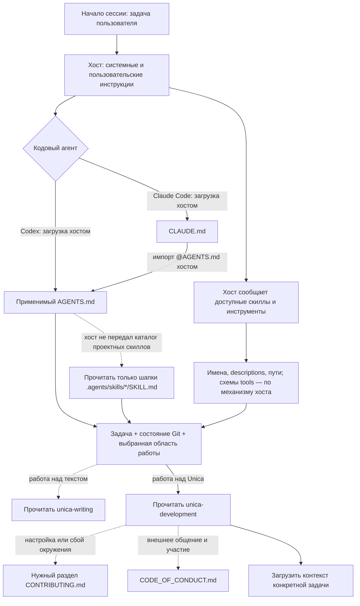
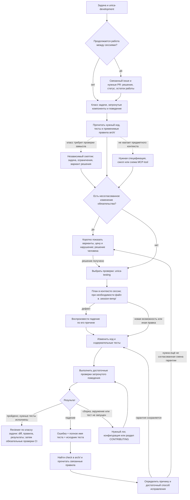

# Как агент получает контекст для разработки Unica

Схема обновлена 2026-09-18. Она показывает, **когда агент узнаёт ограничение
и что вызывает следующее чтение**. Правила продукта приняты владельцем;
порядок разработки, тестирование, редактура и выпуск подключены через
проектные скиллы. Этот обзор сам по себе не меняет инструкции или CI.
Снимки внешних скиллов и MCP ниже относятся к первоначальному исследованию
checkout `9b286de5`; рабочий контракт всегда берётся из используемой сборки.

`AI_DEV.md` читается при настройке процесса. Загружать его целиком перед каждой
правкой не требуется: ниже есть снимки описаний скиллов и инструментов для
сравнения. При работе описания приходят из каталога хоста, выбранного SKILL.md
и схемы инструмента. Этот снимок не становится вторым источником контрактов.

## 1. Старт сессии

Сплошная стрелка — загрузка хостом или чтение агентом, указанные на стрелке.
Пунктир — дополнительное чтение при названном условии. Это логическая схема,
а не обещание одинакового порядка внутренних действий Codex и Claude Code.



Codex получает AGENTS по своей цепочке глобальных и проектных инструкций.
Читать CLAUDE.md для обычной работы Codex не требуется.
Claude Code загружает CLAUDE.md с импортом `@AGENTS.md`. Тела проектных
скиллов выбираются по общему входу; они не импортируются все на старте.
Основание: [OpenAI — AGENTS.md](https://learn.chatgpt.com/docs/agent-configuration/agents-md),
[Anthropic — импорт AGENTS.md](https://code.claude.com/docs/en/memory#agentsmd).

В начале нужны доступные имена и описания скиллов, затем полное тело выбранного
скилла, затем только нужные ему references. Наличие файла на диске или
упоминания в CONTRIBUTING не означает, что хост зарегистрировал скилл.
Такую загрузку описывают [OpenAI](https://learn.chatgpt.com/docs/build-skills)
и [Anthropic](https://code.claude.com/docs/en/skills).

Хост может заранее передать лишние глобальные инструкции и плагины. Репозиторный
Markdown не может убрать уже переданный контекст. Настройка доступного набора
выполняется в хосте; агент не читает тела неприменимых скиллов дополнительно.
Для MCP также различаются подключение сервера и загрузка схемы инструмента:
например, [Claude Code с tool search](https://code.claude.com/docs/en/mcp#scale-with-mcp-tool-search)
откладывает определения инструментов до поиска. В другом режиме схемы могут
попасть в контекст сразу. Не нужно вручную перечитывать весь `tools/list`
в каждой сессии разработки.

## 2. Работа над задачей

Ниже маршрут, заданный `unica-development` и `unica-testing`. CONTRIBUTING
остаётся справкой по окружению, runner исполняет выбранный набор проверок.



Место для планов, служебных меппингов и решений задаёт
[unica-development](.agents/skills/unica-development/SKILL.md#материалы-работы). Локальные
материалы перечитываются только при продолжении той же работы; их наличие
не добавляет обязательного чтения на старте другой задачи.

Ветка воспроизведения дефекта применима только к дефекту. Для новой возможности
агент сначала формулирует ожидаемый результат. Для правки прозы выбирает
проверку содержания и ссылок; тест на слова в Markdown не появляется.
Если автоматическое воспроизведение недоступно, ограничение нужно назвать.
Уже принятое человеком решение не требует повторного согласования.
Независимость скептика и reviewer определяется unica-development; отдельный
скилл не заменяет отдельного проверяющего. Проверяющий получает исходную
задачу, границы изменения, применимые правила и вариант решения либо diff
с результатами проверок. Главному агенту возвращаются выводы и ссылки
на основания; весь прочитанный проверяющим материал копировать не нужно.

Правила читаются **до выбора решения** и дополнительно после падения теста.
Одного чтения после ошибки недостаточно: тест может отсутствовать в профиле,
быть отключённым, неполным или ошибочно изменённым вместе с кодом.
При расширении задачи агент повторяет поиск для новой области.
Для этого достаточно цепочки: компонент → ближайшие тесты → поиск в `arch/`
по путям исходников/тестов и предметным понятиям → чтение подходящих записей.
Если поиск неоднозначен, расширяется выбранная область, а не чтение всего архива.

| Событие | Что дочитываем | Что агент узнаёт |
| --- | --- | --- |
| Продолжается работа между сессиями | Связанный issue и нужные PR; доступные локальные материалы этой задачи | Согласованные решения, текущее состояние и оставшаяся работа |
| Выбрана область изменения | Исходники, ближайшие тесты, применимые записи `arch/` | Нынешнее поведение и согласованные ограничения |
| Меняется XML/DSL 1С | Нужный файл `plugins/unica/references/specs/` и соответствующие фикстуры | Формат, допустимые значения и доказанные примеры |
| Меняется публичный MCP-контракт | Каталог и схема затронутого инструмента, wire-тест, приёмочный сценарий | Что получает клиент и чем проверяется совместимость |
| Нужно написать, выбрать или проверить тест | `unica-testing`; нужные части runner и конфигов | Граница проверки, small/medium/large, разметка, состав запуска |
| Требуется окружение, Inspector или отчёт Allure | Соответствующий раздел `CONTRIBUTING.md` | Команды и предпосылки конкретной операции |
| Меняется описание tool или маршрутизация скилла | `tool-design` при наличии; конкретный сценарий выбора | Как оценить понятность описания действием агента |
| Обнаружено противоречие продуктового правила цели задачи | Само правило, его тест, затронутые потребители | Цена соблюдения и замены; выбор остаётся за человеком |
| Получен запрос выпустить версию | `unica-release` и `docs/release-runbook.md` | Текущий этап выпуска и следующий допустимый шаг |
| Готовится сообщение в issue, PR или обсуждение | Нужная часть `CODE_OF_CONDUCT.md` и правила публикации | Условия участия и общения; поручение на отправку проверяется отдельно |
| Нужна история конкретного решения | Нужный diff или прежняя версия через Git, связанный issue/PR | Основание прошлого выбора; прежнее состояние не задаёт действующее правило |

Обычная правка не требует чтения всех строк этой таблицы. Общие MCP-скиллы
нужны для соответствующей задачи проектирования, UI или упаковки;
сам факт изменения Rust-файла не является причиной загружать весь комплект.

## 3. Как падение теста приводит к чтению правила

Сегодня runner **не загружает архитектурный файл в контекст** и не добавляет
ссылку на него в каждую ошибку. Этот переход выполняет агент.
Для него уже достаточно `check` в записи; дополнительный реестр соответствий
или обратные ссылки в каждом тесте не требуются.

1. Получить исходную ошибку и полную идентичность теста. Rust: target и путь
   модулей; Python: `module.Class.method`. Проверить профиль, features,
   сборку и актуальность отчёта. Отличить падение утверждения от сбоя запуска.
2. Открыть объявление и тело теста. Путь взять из traceback или найти
   в нужном crate/suite; сверить модуль и класс, поскольку имена повторяются.
3. Найти `путь::имя_теста` в действующем `arch/`. Открыть совпадения в поле
   `check` и прочитать применимые правила из `arch/rules/`; исторические
   записи не подменяют действующие.
4. Сопоставить ожидание, правило и поведение. Сбой не даёт разрешения
   ослабить тест или переписать обязательство под реализацию. Если нужно
   изменить обязательство, показать это человеку до зависимой правки.
5. Исправить причину и выполнить точный тест, затем достаточные связанные
   проверки. Не повторять полный набор без новой причины или требования CI.

Пример поиска, который работает в исследованном checkout:

```sh
rg -n -F 'crates/unica-coder/src/infrastructure/workspace_actor.rs::retained_apply_failures_restore_source_cache_and_revision_machine_exactly' arch/rules/
```

Он находит связанное правило. Связь в общем случае не обязана
быть «один тест — одна запись». Отсутствие записи также допустимо: многие
локальные тесты не закрепляют отдельного архитектурного обязательства.
Создавать правило только ради заполнения связи не нужно.

Источники идентичности и ошибок:
[run-unittest.py](scripts/ci/run-unittest.py),
[allure_results.py](scripts/ci/allure_results.py),
JUnit `target/nextest/<profile>/junit.xml` и вывод
[run-tests.py](scripts/ci/run-tests.py). В Python отображаемое имя может
быть строкой docstring; для поиска нужен `fullName`.
Обязательного поля с путём исходника в отчёте нет. Ошибка сборки может
возникнуть до появления свежего JUnit; старый отчёт не доказывает новый запуск.

Прочитанное правило остаётся рабочим ограничением задачи. Это не гарантия
вечной памяти модели. В сводку для продолжения следует включить путь/ID,
существенное ограничение, принятое человеком решение и оставшийся шаг.
После сжатия агент проверяет, доступны ли эти сведения. Потерянные ссылки
восстанавливает поиском по области; перед зависимой работой перечитывает
правило, если формулировка потеряна или могла измениться. Отдельный постоянный
файл пересказов для каждой сессии не нужен.

## 4. Какие скиллы ожидаются

### Скиллы разработки самого Unica

Общий каталог — `.agents/skills/<name>/SKILL.md`. Codex обнаруживает его
штатно. Claude получает общий вход через `@AGENTS.md`; если хост не передал
каталог, агент читает только `name`/`description`, выбирает скилл и открывает
его тело. Репозиторная `.claude/` удалена; нативное обнаружение проектных
скиллов Claude по `.agents/skills/` не предполагается.

В `plugins/unica/skills/` лежат навыки работы с 1С через продукт.
При разработке их поведения читается только затронутый скилл.
Ниже действующие descriptions четырёх проектных навыков:

- **[unica-development](.agents/skills/unica-development/SKILL.md)**

  > Разработка самого Unica — исследование, изменение и ревью кода, правил и документации репозитория. Используй для работы над Unica; задачи с конфигурациями 1С через готовый плагин обслуживают его продуктовые скиллы.

- **[unica-testing](.agents/skills/unica-testing/SKILL.md)**

  > Выбор, написание, запуск и ревью тестов самого Unica — граница проверки, размеры small/medium/large, Rust nextest, Python unittest и разбор падений. Используй при изменении проверок или проверяемого поведения; тесты прикладного кода 1С относятся к unica:test-authoring.

- **[unica-writing](.agents/skills/unica-writing/SKILL.md)**

  > Понятные тексты о самом Unica — архитектурные правила, документация, комментарии к коду, страницы сайта, сообщения коммитов и тексты issues/PR. Используй при их создании, редактировании или ревью.

- **[unica-release](.agents/skills/unica-release/SKILL.md)**

  > Выпуск самого Unica в публичный маркетплейс, проверка состояния версии и продолжение незавершённого выпуска. Используй по запросу выпустить, продвинуть или завершить релиз либо выяснить, почему потребители видят старую версию.

Основной навык направляет в остальные по задаче и не повторяет их процедуры.
Карта кода и порядок PR читаются из его references только при выборе исходников
или работе над PR. Отдельные `unica-architecture` и `unica-review` не создаются:
порядок согласования правила и независимых проходов находится в основном навыке.
Редактура самодостаточна, внешний `/post` не требуется.

### Общие скиллы из CONTRIBUTING

Это каталог для выбора, не последовательность обязательного чтения.
Первые три описания сверены с установленными SKILL.md комплекта
[Anthropic MCP Server Dev](https://github.com/anthropics/claude-plugins-official/tree/main/plugins/mcp-server-dev/skills).
`skill-installer` — встроенный навык Codex; нужен при установке отсутствующего
навыка, а не при каждой разработке. Ниже приведены значения `description`.

- **build-mcp-server** — при выборе нового MCP-контракта или модели доставки:

  > This skill should be used when the user asks to "build an MCP server", "create an MCP", "make an MCP integration", "wrap an API for Claude", "expose tools to Claude", "make an MCP app", or discusses building something with the Model Context Protocol. It is the entry point for MCP server development — it interrogates the user about their use case, determines the right deployment model (remote HTTP, MCPB, local stdio), picks a tool-design pattern, and hands off to specialized skills.

- **build-mcp-app** — для MCP UI:

  > This skill should be used when the user wants to build an "MCP app", add "interactive UI" or "widgets" to an MCP server, "render components in chat", build "MCP UI resources", make a tool that shows a "form", "picker", "dashboard" or "confirmation dialog" inline in the conversation, or mentions "apps SDK" in the context of MCP. Use AFTER the build-mcp-server skill has settled the deployment model, or when the user already knows they want UI widgets.

- **build-mcpb** — для применимого контура упаковки и доставки:

  > This skill should be used when the user wants to "package an MCP server", "bundle an MCP", "make an MCPB", "ship a local MCP server", "distribute a local MCP", discusses ".mcpb files", mentions bundling a Node or Python runtime with their MCP server, or needs an MCP server that interacts with the local filesystem, desktop apps, or OS and must be installable without the user having Node/Python set up.

- **skill-installer** — для настройки набора навыков Codex:

  > Install Codex skills into $CODEX_HOME/skills from a curated list or a GitHub repo path. Use when a user asks to list installable skills, install a curated skill, or install a skill from another repo (including private repos).

CONTRIBUTING также называет следующие девять навыков
[Agent Skills for Context Engineering](https://github.com/muratcankoylan/Agent-Skills-for-Context-Engineering/tree/6dbe1a1d868eab51a3bc9011b0f55e2891513e40/skills).
Они не найдены в проверенных локальных каталогах навыков и не объявлены
доступными в текущей сессии. Описания сверены с указанным commit апстрима;
это не отчёт об установке. Загрузка нужна только для задачи, указанной в шапке.

- **tool-design**:

  > This skill should be used for the tool-interface layer of an agent system specifically: writing tool descriptions agents can route on, designing tool schemas and response formats, naming conventions, actionable error recovery messages, MCP server design, tool-set consolidation, and deciding when to add or remove an individual tool. Use this when the unit of work is a single tool or a set of tools. Route project-shape, pipeline architecture, and task-model-fit decisions to project-development; route deciding whether to introduce sub-agents to multi-agent-patterns.

- **context-optimization**:

  > This skill should be used for improving context efficiency: context budgeting, observation masking, prefix or KV-cache strategy, partitioning, token-cost reduction, retrieval scoping, and extending effective context capacity without lowering answer quality.

- **evaluation**:

  > This skill should be used when building agent evaluation systems: deterministic checks, regression suites, multi-dimensional rubrics, quality gates, production monitoring, baseline comparison, and outcome measurement for agent pipelines.

- **advanced-evaluation**:

  > This skill should be used for advanced LLM evaluation: LLM-as-judge systems, direct scoring, pairwise comparison, rubric calibration, evaluator bias mitigation, confidence scoring, and automated quality assessment.

- **context-fundamentals**:

  > This skill should be used to explain or reason about the foundational concepts of context engineering: what context is, the anatomy of a context window, how attention mechanics work, the U-shaped attention curve, why context quality matters more than quantity, and the mental models needed to interpret every other context-engineering decision. Use this for conceptual explanation, onboarding, and background reading. Route operational work to the specialized skills: debugging attention failures goes to context-degradation, token-efficiency work goes to context-optimization, conversation summarization goes to context-compression, and project-shape decisions go to project-development.

- **context-degradation**:

  > This skill should be used for diagnosing and mitigating context degradation: lost-in-middle failures, context poisoning, context clash, context confusion, attention-pattern issues, and agent performance degradation caused by accumulated or conflicting context.

- **context-compression**:

  > This skill should be used when long-running agent sessions need context compression, structured summarization, compaction, token-per-task optimization, or durable handoff summaries that preserve decisions, files, risks, and next actions.

- **multi-agent-patterns**:

  > This skill should be used when designing multi-agent systems that need context isolation, supervisor or swarm coordination, explicit handoffs, parallel execution, or a decision on whether multiple agents are justified.

- **memory-systems**:

  > This skill should be used for persistent semantic memory in agent systems: cross-session knowledge retention, entity tracking, temporal validity, graph or vector retrieval, memory consolidation, and memory benchmark selection. Route file-backed scratchpads to filesystem-context, handoff summaries to context-compression, and token-efficiency tactics to context-optimization.

Эти описания объясняют и границы применения: evaluation оценивает агентные
системы, memory-systems — память агента. Они не заменяют unica-testing
и не нужны для обычной правки продуктового кеша. Ссылки на дополнительные
навыки внутри descriptions не означают необходимости установить весь апстрим.

`unica-development` переопределяет место сохранения файлов для `brainstorming`
и `writing-plans`. В текущей сессии
они не зарегистрированы; в локальном кеше Superpowers найдены такие описания:

- **brainstorming**: “You MUST use this before any creative work - creating features, building components, adding functionality, or modifying behavior. Explores user intent, requirements and design before implementation.”
- **writing-plans**: “Use when you have a spec or requirements for a multi-step task, before touching code”.

Широкий триггер brainstorming пересекается с unica-development.
Здесь он приведён для разбора нынешнего маршрута, не включён в целевой
обязательный набор. Указания внутри цитат — предмет аудита.

## 5. MCP и инструменты разработки

Для обычной Rust/Python-разработки **обязательных внешних MCP-серверов нет**.
Нужны доступ к файлам и shell, Git, инструменты Rust/Python и test runner.
`rust-analyzer` — LSP; MCP Inspector — клиент; Cargo и `gh` — CLI.
Они не являются MCP-tools, поэтому у них нет шапки MCP `description`.

Единственный сервер в конфигурации плагина
[plugins/unica/.mcp.json](plugins/unica/.mcp.json) — `unica`.
Он нужен как проверяемый продукт для MCP-сценариев, а не как обязательный
инструмент редактирования Rust. Запускать его следует из проверяемой сборки
с явным рабочим каталогом и отдельным состоянием демона; порядок дан в
[CONTRIBUTING — Inspector](CONTRIBUTING.md#mcp-inspector-локально).

При работе с GitHub использовать `gh` или доступный connector.
Конкретный MCP-сервер GitHub проектом не закреплён. Его схему агент получает
при нужном действии, не загружает весь каталог операций GitHub на старте.
Внутренние движки из `plugins/unica/third-party/tools.lock.json` не нужно
подключать как дополнительные публичные MCP-серверы агента.

### Ожидаемые инструменты проверяемой Unica

Снимок из [tool_catalog.rs](crates/unica-coder/src/application/v13/tool_catalog.rs)
и [task_tools.rs](crates/unica-coder/src/application/v13/task_tools.rs).
`description` приведён без пересказа. Для вызова также нужна актуальная
`inputSchema`; загружать все схемы в этот документ не требуется.
Имена здесь канонические, префикс вызова назначает хост.

| Tool сервера `unica` | `description` |
| --- | --- |
| `unica.view` | Inspect the workspace with no arguments, or read one logical 1C node by address. |
| `unica.apply` | Preview or atomically apply typed edits to one logically addressed 1C node. |
| `unica.resolve` | Emergency bridge between a logical address and the source layout, in both directions. Use it only when a path arrived from outside Unica - a diff, a build log, a stack trace - or when a file has to be opened outside Unica. To find an object by name use search; to read it use view. |
| `unica.search` | Search one corpus for a query: BSL module text, or the names and synonyms of metadata objects. Optionally under one logical subtree. |
| `unica.check` | Confirm workspace source-set admission, or validate one logical node: readability plus every validator its kind owns. |
| `unica.diff` | Compare two readable logical nodes of the same kind without changing files. |
| `unica.run` | List canonical runtime operations and their invocation contract, or preview/execute one implemented operation. |
| `unica.docs` | Search bundled Unica and safe 1C documentation by topic. |
| `unica.task.get` | Read the current durable Task state immediately without waiting or re-running the subject tool. |
| `unica.task.result` | Wait for a Task result for a bounded interval; returns the canonical result or a new working receipt without re-running the subject tool. |
| `unica.task.cancel` | Idempotently request cancellation and return the current durable Task state without re-running the subject tool. |

Первые восемь tools входят в основной каталог. Последние три добавляются
профилем совместимости; с native Tasks их нет. Этот выбор находится в
[interfaces/mcp.rs](crates/unica-coder/src/interfaces/mcp.rs).
Поэтому требование «всегда ровно 11 tools» неверно.
`initialize`, `tools/list`, `tools/call` — методы протокола, не дополнительные tools.

При обычной правке Rust этот каталог не дочитывается. При изменении
MCP-поведения агент получает схему затронутого tool и ответ соответствующего
сценария; полный `tools/list` нужен при проверке состава поверхности.
`unica.check` проверяет 1С-источники и не заменяет Rust/Python-тесты Unica.

В исследованной сессии установленный плагин предоставляет более старые имена,
включая `unica.documentation.search`, а checkout — `unica.docs`.
Наличие и успех tools установленного плагина не доказывают работу этой сборки.
Список выше сверён по коду; живой MCP-сеанс в рамках создания схемы не запускался.

## 6. Где должна жить каждая обязанность

Распределение реализовано в проектных файлах; границы проверки хостов приведены ниже.

| Файл | Собственная роль | Когда читается |
| --- | --- | --- |
| `CLAUDE.md` | Совместимость хоста: подключить общий AGENTS | Автоматически в Claude |
| `AGENTS.md` | Короткий вход: основной скилл, источники, поиск, порядок разрешения противоречий | На старте |
| `.agents/skills/unica-development/SKILL.md` | Выбрать область и порядок работы, нужные знания и проверки; определять место рабочих материалов и продолжение по issue | При разработке Unica |
| `.agents/skills/unica-testing/SKILL.md` | Выбор и качество тестов, разметка, запуск, разбор ошибок и поиск правила | При работе с проверками |
| `.agents/skills/unica-writing/SKILL.md` | Ясные тексты разных жанров с сохранением фактов и границ гарантий | При работе над текстом |
| `.agents/skills/unica-release/SKILL.md` | Определить этап выпуска и направить в runbook | При выпуске |
| `arch/rules/**/*.md` | Согласованные атомарные гарантии продукта с `check` | По области задачи и по упавшему тесту |
| `CONTRIBUTING.md` | Подготовка окружения и справка по инструментарию | По нужному разделу |
| `CODE_OF_CONDUCT.md` | Взаимодействие в сообществе | При участии и общении |
| Код, тесты, конфиги runner и workflow | Реальное поведение и исполняемые проверки | По изменению и результату запуска |
| `AI_DEV.md` | Обзор маршрутов для настройки процесса | При изменении самой схемы |

Ссылка нужна там, где возникает решение дочитать источник. Полный текст
правила живёт в одной записи, процедура — в своём скилле. Код показывает,
что происходит; согласованное правило — что должно сохраняться. Расхождение
требует разбора, а не автоматического приведения правила к текущему коду.

Маршруты подключены файлами, но это ещё не доказывает поведение хоста.
Проверка выполняется в новых сессиях: какие источники действительно попали
в контекст, какое правило прочитано до решения, какой тест исполнился
и что агент дочитал после ошибки. Для этого подходят локальная правка,
MCP-изменение, падение теста с `check` и продолжение работы после передачи
контекста. Заявления «прочитал всё» и тесты на слова этого не проверяют.

Для Codex подтверждены обнаружение четырёх навыков как `repo/enabled` через
`skills/list` и выбор development/testing в новой CLI-сессии: агент прочитал
правило, тело теста и выполнил существующую проверку платформенной границы.
Для Claude настроен импорт, но реальный маршрут пока не проверен: локальный
CLI не авторизован. Независимые субагенты не заменяют проверку этого хоста.

Runner не загружает Markdown в контекст: поиск связанного правила остаётся
действием агента по unica-testing. Каталог внешних инструментов, уже переданный
хостом на старте, инструкции репозитория сократить не могут.
