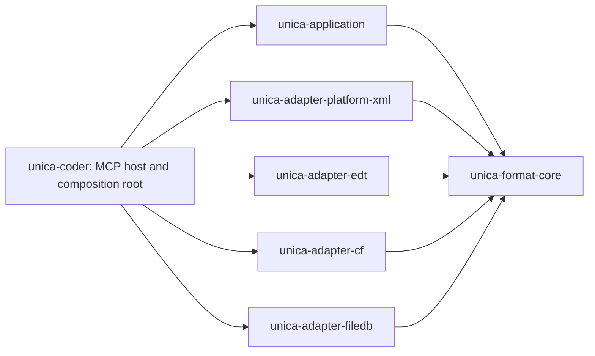

# Versioned Format Adapter Boundary and Semantically Complete Metadata Navigation

- Date: `2026-07-26`
- Status: `approved`
- Decision: `ADR-0019`

## Merge status

This is the implementation design for
[`2026-07-26-versioned-source-adapter-architecture.md`](2026-07-26-versioned-source-adapter-architecture.md).
Its live rules are owned by ADR-0019 and the architecture registries. Tasks
1-7 are implemented on the branch, Task 8 remains under review, and Tasks 9-12
are not complete. In particular, this document does not claim `write-safe`
status for Platform XML or implementation support for EDT, direct CF, or
FileDB.

## Context

PR #210 introduces a structured metadata navigation response for `unica.meta.info`.
The prototype proves snapshot-based navigation and typed JSON, but it has two
architectural and functional gaps:

1. Platform XML concepts and parser types can leak into application code.
2. The prototype exposes less useful metadata than the removed legacy
   `meta.info Mode=full` output for several metadata classes.

Unica must eventually support several independent source families and multiple
versions of each family:

- Designer/Configurator Platform XML exports;
- EDT project formats;
- direct binary CF/CFE reads;
- direct 1C FileDB reads.

The public contract must remain stable while those implementations evolve. It
must also be convenient for an AI consumer: typed JSON, stable semantic names,
explicit capabilities, deterministic pagination, and no native-format syntax.

Backward compatibility with the legacy text response is not required. Useful
semantic information from that response is required.

## Design goals

- Keep all knowledge of a native format inside the crate responsible for that
  format family.
- Keep version-specific format knowledge inside private modules of that crate.
- Prevent application code from importing adapter crates or parser libraries.
- Return a typed, semantically complete JSON model to AI clients.
- Make silent information loss impossible to report as a ready result.
- Preserve at least all useful information available from legacy
  `meta.info Mode=full` and its name-based drill-down.
- Allow future format families to be added without changing application use
  cases or the MCP contract.
- Apply the boundary to both reads and writes, including existing metadata,
  form, support, subsystem, role, template, and validation operations.

## Non-goals

- Preserve the legacy text layout, headings, modes, stdout, or offset paging.
- Expose raw XML, XPath, namespace URIs, binary block identifiers, parser ASTs,
  native file layouts, or source filesystem paths in public results.
- Provide byte-level lossless decompilation of every source family.
- Implement EDT, direct CF, or direct FileDB adapters in PR #210.
- Add empty placeholder crates for future adapters.

## Important interpretation of "lossless"

The contract is semantically lossless for its declared coverage, not byte
lossless and not a generic native-tree dump. Every meaningful fact encountered
within declared coverage must map to a core-owned semantic identifier and typed
value. If it cannot be mapped, the result is `partial` and carries a neutral
`unmappedSemanticFact` diagnostic.

This resolves the apparent conflict between completeness and encapsulation:
native keys never cross the adapter boundary, but an adapter also cannot hide a
fact and claim complete coverage.

For writers, untouched semantic data must be preserved. Byte-identical output
is required only where an operation explicitly advertises that capability.

## Physical architecture



### `unica-format-core`

This crate owns the stable, format-neutral domain contract:

- semantic property, relation, facet, and object-kind identifiers;
- typed semantic values and property envelopes;
- object references, nodes, relations, selections, snapshots, and cursors;
- adapter descriptors and capability descriptors;
- neutral reader, writer, validator, probe, and snapshot ports;
- neutral errors and diagnostics.

It has no filesystem implementation, XML parser, binary parser, MCP transport,
or dependency on an adapter crate.

### `unica-application`

This crate owns format-neutral use cases and orchestration. It depends only on
`unica-format-core` and other format-neutral domain crates. It cannot select or
branch on an adapter family, native format version, XML element, or binary
layout.

Application commands are semantic commands. A raw `serde_json::Value`, XML
fragment, native AST, or arbitrary native property map is not an accepted
escape hatch for a writer port.

### Family adapter crates

Each source family is implemented in one physical crate:

- `unica-adapter-platform-xml`;
- `unica-adapter-edt`;
- `unica-adapter-cf`;
- `unica-adapter-filedb`.

A family crate may depend on `unica-format-core` and the parser libraries needed
for its format. It publicly exposes only a factory or registration function
whose products implement core-owned ports.

Native documents, ASTs, tags, namespaces, block identifiers, offsets, checksums,
layout structs, and serializers remain private.

### Private version modules

Version routing belongs to the family adapter. Example:

```text
unica-adapter-platform-xml/
  src/
    lib.rs
    probe.rs
    versions/
      mod.rs
      v2_20/
        decoder.rs
        encoder.rs
        schema.rs
        projector.rs
```

`versions` and `v2_20` are private. The application receives an opaque adapter
descriptor and capabilities but cannot import a version module or match on a
version to alter behavior.

### `unica-coder`

`unica-coder` becomes the MCP host and composition root. It constructs the
application, registers adapter factories, converts MCP input into neutral
commands, and serializes neutral results. It contains no native parser or
serializer logic.

Physical extraction of application code is required. Keeping application and
composition in one crate would allow application modules to import adapter
dependencies and would make the boundary advisory rather than compiler-backed.

## Closed semantic vocabulary

All public identifiers are owned by `unica-format-core`:

- `SemanticPropertyId`;
- `SemanticRelationId`;
- `SemanticFacetId`;
- `SemanticObjectKind`;
- semantic enum values.

They serialize to stable strings such as:

- `metadata.name`;
- `presentation.object`;
- `document.number.length`;
- `document.posting.mode`;
- `register.periodicity`;
- `attribute.fillChecking`;
- `httpService.rootUrl`.

The underlying Rust values are not constructible from arbitrary adapter-owned
strings. Core exposes constants or validated constructors backed by its own
registry. Adding a new public concept requires changing core and its public
contract tests.

An adapter cannot publish an XML tag, EDT property name, binary block ID, or
other native identifier as an extension key. A meaningful source fact with no
semantic identifier lowers coverage to `partial`.

## Public navigation document

`unica.meta.info` returns JSON only under `data.navigation`. It does not return
legacy stdout text.

The top-level navigation value has exactly these conceptual fields:

```json
{
  "schemaVersion": "1",
  "status": "ready",
  "snapshot": {},
  "root": {},
  "nodes": [],
  "relations": [],
  "diagnostics": []
}
```

No extra graph wrapper is introduced.

### Nodes

A node represents one semantic object, including child entities that previously
appeared only as lines in a parent object's text report.

```json
{
  "objectRef": "Document.Shipment",
  "kind": "document",
  "properties": {
    "metadata.name": {
      "type": "string",
      "valueState": "explicit",
      "value": "Shipment",
      "provenance": "declared",
      "capability": "readOnly"
    },
    "document.number.length": {
      "type": "integer",
      "valueState": "explicit",
      "value": 11,
      "provenance": "declared",
      "capability": "readOnly"
    }
  },
  "facets": {
    "identity": ["metadata.name", "metadata.synonym"],
    "numbering": ["document.number.type", "document.number.length"]
  },
  "capabilityState": {}
}
```

`properties` is the single source of truth for values. `facets` contains
core-owned groupings of property or relation identifiers and does not duplicate
values. This gives AI clients an easy semantic index without creating two
independently mutable representations.

### Property envelope

Every property has:

- `type`;
- `valueState`;
- `value` when available;
- neutral `provenance`;
- per-property `capability`.

Supported value types include:

- `boolean`;
- `integer`;
- `decimal`;
- `string`;
- `localizedString`;
- `uuid`;
- `enum`;
- `date`;
- `typeSet`;
- `objectRef`;
- `list`;
- `structure`;
- `null`;
- `unknown`.

Supported value states are:

- `explicit`;
- `defaulted`;
- `inherited`;
- `computed`;
- `absent`;
- `unresolved`.

Provenance is semantic, for example `declared`, `default`, `inherited`, or
`derived`. It does not name a descriptor file, XML path, native block, or parser
node.

`unknown` is allowed only for a known semantic property whose value cannot be
interpreted. It forces `status=partial`; it is never used to disguise a native
property that has no semantic identifier.

### Relations and child entities

Attributes, tabular sections, dimensions, resources, enum values, forms,
templates, commands, URL templates, HTTP methods, web-service operations, and
operation parameters are nodes with their own typed properties.

Core-owned relations connect them, for example:

- `contains.attribute`;
- `contains.tabularSection`;
- `contains.dimension`;
- `contains.resource`;
- `contains.enumValue`;
- `contains.form`;
- `contains.template`;
- `contains.command`;
- `contains.httpMethod`;
- `contains.webServiceOperation`;
- `operation.parameter`;
- `document.basedOn`;
- `document.registerRecord`.

Relation order is explicit where source order has semantics.

## Legacy information parity baseline

Legacy output is not retained at runtime. Its useful information becomes a
parity inventory and test oracle. New output is complete only if it represents
at least the following facts.

| Legacy area | Required neutral representation |
| --- | --- |
| Generic object identity | metadata kind, name, UUID, synonym, comment |
| Presentations | object, list, and extended presentations as localized values |
| Support | support state, authorability, and edit capabilities |
| Documents | number type, length, periodicity, autonumbering, posting, register records, based-on objects |
| Catalogs | hierarchy type, hierarchy level limit, code length, description length |
| Registers | dimensions, resources, periodicity, write mode, register type |
| Constants | value type as a typed `typeSet` |
| Reports | main data composition schema reference |
| Defined types | complete typed `typeSet` |
| Common modules | all legacy flags and return-values reuse mode |
| Scheduled jobs | method, use, predefined state, restart count, restart interval |
| Event subscriptions | event, handler, and source type set |
| HTTP services | root URL, URL templates, methods, HTTP method, handler |
| Web services | namespace, operations, parameters, directions, return type, procedure name |
| Enumerations | value name, synonym, and comment |
| Attributes/dimensions/resources | name, type, required/fill checking, indexing, multiline, use, fill value, master, main filter, synonym |
| Tabular sections | section nodes, column nodes, order, and containment |
| Forms/templates/commands | child nodes, identity, containment, and available details |

The implementation may expose additional semantic facts. Legacy parity is the
minimum, not the maximum or the definition of the native format.

Only these legacy mechanics are intentionally removed:

- human-oriented headings and table formatting;
- `brief`, `overview`, and `full` rendering modes, replaced by selections;
- `Name` drill-down, replaced by object references and relations;
- offset pagination, replaced by bound cursors;
- stdout transport, replaced by typed JSON.

## Adapter contracts

Core defines small capability-oriented ports rather than one format-shaped
interface:

- probe and adapter selection;
- immutable snapshot creation;
- object read and relation traversal;
- semantic mutation;
- validation;
- capability inspection.

The composition root selects an adapter factory from probe results. Application
use cases receive an erased core port and do not know which factory won.

A source locator may contain a filesystem path internally so an adapter can
open a source. It is an input transport concern and is not serialized into the
public navigation response or cursor.

Existing Platform XML writers move behind semantic writer ports. Operations
such as support editing, metadata creation, form editing, subsystem editing,
role editing, and template editing use core-owned command types. The adapter
maps those commands to its private native representation.

Direct CF and FileDB adapters initially advertise read capabilities only. An
unsupported write is `capabilityUnavailable`, never a best-effort mutation.

## Snapshots, lazy navigation, and cursors

Reads use immutable retained snapshots. A live source changing does not mutate
or invalidate an existing snapshot. A new capture creates a new revision.

A snapshot becomes stale only when it is missing, evicted, lost after restart,
bound to a different authorization scope, or explicitly incompatible with the
request.

Lazy navigation supports:

- an object path for initial selection;
- `objectRef` plus snapshot revision for stable follow-up reads;
- an opaque cursor for relation pages.

Cursors are path-free, authenticated, bound to the snapshot, authorization
scope, relation, selection, and page size. Offset pagination is not supported.
Relation pages default to 25 items and allow at most 100.

## Coverage and status semantics

`ready` means every requested fact within the adapter version's declared
coverage was represented in the neutral model.

`partial` means the source was readable but at least one requested fact was
unmapped, unresolved, corrupt in a recoverable area, or outside certified
coverage.

`unsupported` means no adapter, version, or required capability can service the
request.

Neutral diagnostic codes include:

- `unsupportedFormat`;
- `unsupportedVersion`;
- `capabilityUnavailable`;
- `partialCoverage`;
- `corruptSource`;
- `unmappedSemanticFact`;
- `snapshotStale`;
- `invalidCursor`.

Public diagnostics identify semantic scope and object references. Native parser
details remain in adapter-internal logs and are not part of the public schema.

## Adapter coverage manifests

Every adapter version owns a machine-readable coverage manifest that declares:

- supported object kinds;
- supported semantic properties;
- supported relation kinds;
- supported read selections;
- supported mutations;
- known partial areas;
- fixture sets used for certification.

The manifest uses core semantic identifiers only. It cannot contain public
native keys as substitutes for unmapped concepts.

A release cannot mark an adapter/version ready for a declared area if parity or
coverage tests find an unmapped meaningful fact.

## Architecture enforcement

The boundary is enforced by several independent mechanisms.

### Cargo dependency direction

A CI check based on `cargo metadata` rejects:

- any adapter dependency from `unica-application`;
- any parser/serializer dependency in `unica-format-core` or
  `unica-application`;
- dependencies from core back to the host or an adapter;
- cross-family adapter dependencies unless a separate ADR explicitly permits
  one.

### Rust visibility and API checks

Native and version modules are private. Compile-fail/API tests verify that a
consumer can construct an adapter only through its public factory and cannot
name native documents, schemas, version projectors, parser nodes, or encoders.

### Source-boundary checks

A focused CI rule rejects known native parser imports, namespace constants,
format tags, binary layout types, and adapter imports outside their allowed
crates and the composition root. This is a secondary guard; physical crate
separation remains the primary protection.

### Public serialization checks

Contract tests recursively inspect navigation JSON and reject native transport
fields such as raw XML, XPath, namespaces, source paths, byte offsets, and block
IDs. Golden examples contain only semantic identifiers from the core registry.

### Parity and coverage tests

Each Platform XML version fixture is projected into semantic facts. Tests assert
all applicable legacy parity facts and all facts declared by the version
coverage manifest.

A fixture containing a meaningful but deliberately unmapped native fact must
produce `partial` and `unmappedSemanticFact`. A test that silently drops it must
fail.

### Writer preservation tests

Writer tests compare semantic projections before and after a mutation. The
requested facts must change as commanded, unrelated semantic facts must remain
unchanged, and the output must remain readable by the same adapter version.

## PR #210 migration boundary

PR #210 performs the migration atomically for the currently supported Platform
XML path:

1. Resolve the existing merge with `main`, preserving current mainline format
   validation and mutation behavior.
2. Keep the new JSON navigation contract and remove the runtime legacy text
   implementation.
3. Convert the legacy information inventory into semantic parity tests.
4. Extract `unica-format-core` and `unica-application`.
5. Create `unica-adapter-platform-xml` with private format 2.20 modules.
6. Move all existing Platform XML interpretation and serialization behind that
   adapter boundary, not only `meta.info`.
7. Extend the semantic vocabulary, node roles, relations, and value projection
   to cover the complete parity baseline.
8. Add coverage manifests and architecture guards.
9. Update the MCP contract and `meta-info` skill to describe JSON only.

Code that only transports an opaque source or invokes a neutral port may remain
outside the adapter. Code that understands a tag, schema node, native value,
file layout, or version-specific rule may not.

No EDT, direct CF, or direct FileDB implementation is added in this PR. Future
implementations add family crates that conform to the same core ports and
coverage rules.

## Acceptance criteria

- `unica.meta.info` returns only `data.navigation` and no legacy stdout.
- Every useful legacy `Mode=full` and drill-down fact has a tested semantic
  representation.
- Specialized child entities are nodes connected by typed relations.
- Property values remain typed and preserve localization and complete type sets.
- No Platform XML parser, schema, tag, namespace, or version type is reachable
  from application code.
- Existing Platform XML mutations use semantic writer ports.
- Unknown meaningful facts cannot produce `status=ready`.
- Architecture, API-boundary, public-schema, parity, coverage, cursor, snapshot,
  and writer-preservation tests pass.
- The open PR documents only Platform XML 2.20 as implemented coverage and does
  not claim EDT, direct CF, or direct FileDB support.

## Consequences and trade-offs

The closed semantic vocabulary adds deliberate friction: a newly discovered
source concept requires a core contract change before an adapter can expose it.
That cost is the protection against native-format leakage and unstable ad-hoc
keys.

Physical extraction makes PR #210 larger than a local `meta.info` refactor. The
larger change fixes the architectural cause. Leaving old Platform XML readers
and writers in the host would create an immediate exception and make the new
boundary non-credible.

A family crate can grow as versions accumulate. Private version modules share
family-level IO and semantic projection helpers, while coverage manifests keep
version behavior explicit. If a family later becomes too large, version modules
can be extracted into crates without changing the core or public JSON contract.

The current merge also preserves main's provider-neutral code-intelligence
services. Those providers are orthogonal application services: they do not
select format decoders, inspect native source layouts, or bypass the neutral
source-session and writer ports described here.
