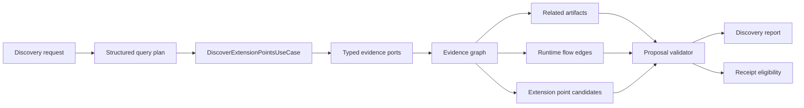

# Project Discovery And Discovery Receipts

Status: accepted on 2026-07-17. This document defines the target architecture,
public contract, rollout policy, acceptance thresholds, and migration boundary
for Project Discovery and Discovery Receipts.

This document is the active design source for evidence-backed discovery of 1C
extension points. Current code, tests, and package metadata remain stronger
sources of truth if they contradict this design.

## Problem

An agent can produce technically valid 1C code while choosing the wrong
application mechanism or extension point. Skill text can recommend preliminary
research, but it cannot enforce that research before an applied mutation.

PR #83 introduced the useful product idea `unica.project.discover`, evidence
locations, partial results, source-set selection, and support warnings. Its
implementation must not be adopted as the target architecture because it:

- treats related metadata artifacts as extension points;
- contains domain-specific series and shelf-life enrichment in the core;
- uses one scalar score as relevance, evidence, actionability, and confidence;
- does not universally validate proposed extension points;
- cannot enforce discovery before an applied mutation;
- lets infrastructure rescan XML/BSL, read SQLite, and parse display-oriented
  adapter output directly;
- mixes optional missing checks with blockers;
- does not model a verified runtime flow from entry point to change target.

The replacement is staged. The public product idea is preserved, while the
discovery core and its evidence boundaries are rebuilt.

## Goals

- Find artifacts related to a task without calling them extension points.
- Reconstruct relevant runtime flows using typed evidence.
- Identify actionable extension point candidates.
- Validate an agent's proposed mechanism as supported, contradicted, or
  unknown.
- Preserve source, path, line, provider, and freshness provenance.
- Degrade explicitly when an evidence provider is unavailable.
- Produce a scoped discovery receipt only after a proposal is verified.
- Allow the application layer to introduce a gradual advisory-to-enforced gate.
- Remain domain-neutral in the core.

## Non-Goals

- Embedding an LLM, ontology, or semantic vector database in the core.
- Hard-coding UT series, expiry-date, document, form, or handler names.
- Treating discovery as user authorization to mutate files.
- Immediately requiring a receipt for every mutating tool.
- Redesigning secure SQLite snapshot access in the discovery change. WAL/SHM,
  macOS canonical paths, and Windows sharing semantics require a separate
  design.
- Returning to skill-local scripts or exposing internal analyzers as public MCP
  servers.

## Architecture Boundary



### Query Plan

The caller supplies the original task plus a structured plan containing domain
concepts, exact search terms, known artifacts, and optional proposed targets.
The agent owns semantic expansion from human language into that plan. Unica may
perform generic token normalization but must not silently add domain-specific
synonyms.

### Application Use Case

`DiscoverExtensionPointsUseCase` owns orchestration. It asks typed ports for
facts, builds an evidence graph, classifies results, validates proposals, and
creates the report. It does not parse human-readable adapter output.

Target application ports are:

- `MetadataCatalogPort`;
- `CodeSearchPort`;
- `DefinitionPort`;
- `CallGraphPort`;
- `FormInspectionPort`;
- `SupportStatePort`.

Each evidence port returns `ProviderOutcome<T>` with exactly five application
states: `complete`, `bounded`, `unavailable`, `failed`, or
`contract_violation`. Complete and bounded outcomes carry a typed
`ProviderBatch<T>`; every record in the batch repeats its canonical identity,
location, provider name/version, coverage, content source fingerprint, and
diagnostic workspace epoch. `unavailable` and `failed` are reportable
degradation, while only `contract_violation` is a fatal evidence-provider
error. A complete empty batch is negative proof only for the exact typed query
sent to that port. Bounded, unavailable, and failed outcomes are never negative
proof.

Ports return typed records containing stable artifact identities, locations,
provider provenance, and freshness. Infrastructure adapters implement those
ports. An infrastructure adapter must not call another adapter, select an
architecture, or convert a non-empty result into a confidence claim.

Platform-owned callbacks are represented by a versioned, domain-neutral
binding catalog keyed by platform script variant, metadata kind, module kind,
method name, export state, and signature. `MetadataCatalogPort` exposes those
facts with provider provenance. A method name or call-graph node alone does not
prove that the 1C platform invokes it.

Binding and call facts preserve mechanism semantics in their typed payload and
stable evidence digest. Binding facts carry the exact event or action, HTTP
verb and URL template, scheduled-job enabled state, and execution context when
the mechanism requires them. Call facts carry resolution state, call type, and
execution context. Validators must not reconstruct any of these values from an
artifact name or display text.

The canonical binding compatibility matrix is:

| `BindingDetails` | Accepted `FlowKind` | Supplying evidence port |
| --- | --- | --- |
| `Structural` | `contains`, `defines` | `MetadataCatalogPort` |
| `EventSubscription` | `subscribes` | `MetadataCatalogPort` |
| `FormCommand` | `handles` | `FormInspectionPort` |
| `CommonCommand` | `handles` | `MetadataCatalogPort` |
| `ScheduledJob` | `handles` | `MetadataCatalogPort` |
| `HttpRoute` | `handles` | `MetadataCatalogPort` |
| `ExchangePlan` | `handles` | `MetadataCatalogPort` |

Every other `BindingDetails` x `FlowKind` x evidence-port combination is a
`ProviderContractViolation` and must be rejected before evidence-graph promotion.
Infrastructure adapters must emit only these combinations and must not guess a
relation from artifact names, display text, or provider availability.

`contains` and `defines` structural edges remain observed graph evidence; they
never populate `connection_ports`, establish runtime reachability, or make a
candidate actionable.

Non-evidence orchestration remains behind separate
`ProjectSourceResolverPort`, `SourceSnapshotPort`, and `ReceiptIssuerPort`
boundaries. The application-owned `SourceSnapshot` contains exactly one
analysis snapshot plus a canonically sorted and deduplicated set of mutation
snapshots, reuses the domain `SourceFormat`, and binds content fingerprints
rather than timestamps. Concrete filesystem capture and persistent receipt
issuance are later infrastructure slices; the interim no-op issuer contributes
the stable `receipt_store_not_implemented` eligibility blocker.

### Evidence Graph

The graph represents metadata objects, modules, methods, forms, commands,
handlers, subscriptions, and scheduled jobs. Typed edges include `contains`,
`defines`, `calls`, `handles`, `subscribes`, and `uses`.

Every report conclusion references evidence identifiers. A lexical match or a
single definition is not proof of runtime reachability.

### Result Domains

The report separates three domains:

1. `relatedArtifacts`: objects relevant to the task context.
2. `flowEdges`: verified relationships in the runtime path.
3. `extensionPointCandidates`: executable or declarative hooks where a change
   can be made.

A document, attribute, tabular section, form, or module can be a related
artifact without being an extension point. A candidate normally identifies a
method, handler, command binding, subscription, scheduled-job binding, or other
actionable hook.

### Proposal Validation

Each proposed target receives one verdict:

- `supported`: positive evidence establishes the required facts;
- `contradicted`: explicit negative evidence disproves the proposal;
- `unknown`: evidence is insufficient.

Absence of positive evidence is not contradiction.

The validator reports existence, runtime reachability, support risk, coverage
gaps, blocking checks, and evidence identifiers separately.

## Public MCP Contract

The only public MCP server remains `unica`. Discovery uses one public tool:

```text
unica.project.discover
```

The unmerged schema from PR #83 is not a compatibility target. The replacement
starts with `schemaVersion: 1`.

### Modes

- `explore`: discover mechanisms and candidates; never emits a receipt.
- `validate`: rerun discovery against the current source state, validate
  explicit proposals, and emit a receipt only when all receipt requirements
  pass.

Using one explicit two-mode tool avoids a second LLM-visible confirmation tool
and avoids inferring behavior merely from the presence of an optional field.

### Input

```json
{
  "mode": "explore",
  "task": "Запретить приемку партии с недостаточным остаточным сроком хранения",
  "concepts": [
    "приемка товара",
    "остаточный срок хранения",
    "серия номенклатуры"
  ],
  "searchTerms": ["ГоденДо", "СрокГодности", "ОстаточныйСрок"],
  "knownArtifacts": [
    {
      "kind": "metadata_object",
      "ref": "Document.ПриобретениеТоваровУслуг"
    }
  ],
  "sourceSet": "main",
  "limits": {
    "maxCandidates": 20,
    "maxGraphDepth": 4,
    "maxEvidence": 200
  }
}
```

Input rules:

- `mode` is required and is `explore` or `validate`.
- `task` is required, non-blank, records the user-visible intent, and is at
  most 8192 UTF-8 bytes.
- `concepts` is required and contains 1 to 64 unique, non-blank semantic
  concepts supplied by the caller; each is at most 256 UTF-8 bytes.
- `searchTerms` is optional and contains at most 128 unique, non-blank exact
  identifiers or text fragments of at most 256 UTF-8 bytes each.
- `knownArtifacts` is optional and contains at most 128 unique typed canonical
  references.
- `proposals` is forbidden in `explore` and contains 1 to 32 entries in
  `validate`; proposal IDs are unique.
- `sourceSet` selects the analysis source-set from `unica.project.map`;
  arbitrary source paths are not the primary contract.
- `limits` are bounded resource limits, not relevance thresholds. Defaults are
  `maxCandidates=20`, `maxGraphDepth=4`, and `maxEvidence=200`; accepted ranges
  are respectively `1..=100`, `1..=12`, and `1..=2000`.
- the schema rejects unknown properties.

Every proposal requires `id`, `target`, and a non-blank `intent` of at most
2048 UTF-8 bytes. `id` is 1 to 64 ASCII characters, begins with an alphanumeric
character, and thereafter contains only ASCII alphanumerics, `.`, `_`, or `-`.
Source-set names and every resolver string argument are non-blank and at most
1024 UTF-8 bytes; the more specific artifact and identifier rules still apply.

The application still resolves the workspace from the standard `cwd` argument.

### Artifact Reference

```json
{
  "kind": "method",
  "ref": "Document.ПриобретениеТоваровУслуг.ObjectModule.ПередЗаписью"
}
```

Initial `kind` values are:

- `metadata_object`;
- `metadata_attribute`;
- `tabular_section`;
- `tabular_section_attribute`;
- `module`;
- `method`;
- `form`;
- `form_command`;
- `common_command`;
- `event_subscription`;
- `scheduled_job`;
- `http_route`;
- `exchange_plan`;
- `report`;
- `data_processor`.

Discovery returns canonical references. A caller should reuse those references
instead of reconstructing internal paths.

A canonical `ref` is 1 to 1024 UTF-8 bytes and consists of dot-separated,
non-empty identifier segments. A segment is at most 128 Unicode scalar values
and contains only Unicode alphanumeric characters or `_`. Path separators,
control characters, leading/trailing dots, and empty or traversal segments are
forbidden. Providers preserve registered 1C spelling in output; identity
comparison uses Unicode lowercase segment comparison. Kind-specific parsers
also verify the expected owner/module/member shape, so a syntactically valid
method-shaped string cannot be accepted as a metadata object.

Version-1 canonical shapes are:

| `kind` | Canonical `ref` shape |
| --- | --- |
| `metadata_object` | `<ObjectKind>.<ObjectName>` for a registered platform metadata kind not represented by a more specific root kind below |
| `metadata_attribute` | `<OwnerRef>.Attribute.<AttributeName>` |
| `tabular_section` | `<OwnerRef>.TabularSection.<SectionName>` |
| `tabular_section_attribute` | `<OwnerRef>.TabularSection.<SectionName>.Attribute.<AttributeName>` |
| `module` | `CommonModule.<ModuleName>`, `<OwnerRef>.<ModuleKind>`, or `<FormRef>.FormModule` |
| `method` | `<ModuleRef>.<MethodName>` |
| `form` | `<OwnerRef>.Form.<FormName>` |
| `form_command` | `<FormRef>.Command.<CommandName>` |
| `common_command` | `CommonCommand.<CommandName>` |
| `event_subscription` | `EventSubscription.<SubscriptionName>` |
| `scheduled_job` | `ScheduledJob.<JobName>` |
| `http_route` | `HTTPService.<ServiceName>.URLTemplate.<TemplateName>.Method.<MethodName>` |
| `exchange_plan` | `ExchangePlan.<PlanName>` |
| `report` | `Report.<ReportName>` |
| `data_processor` | `DataProcessor.<ProcessorName>` |

`OwnerRef`, `FormRef`, and `ModuleRef` mean the complete canonical reference of
that typed owner, not a caller-provided path. `ObjectKind` comes from the same
versioned singular metadata-kind registry used by Platform XML providers.
Specialized roots (`CommonCommand`, `EventSubscription`, `ScheduledJob`,
`ExchangePlan`, `Report`, and `DataProcessor`) use their specialized kind and
are not duplicated as `metadata_object` identities. A `CommonModule` is a
self-owned `module` with canonical ref `CommonModule.<ModuleName>`; it is not
duplicated as a `metadata_object`, and its method is
`CommonModule.<ModuleName>.<MethodName>`. `ModuleKind` for owner-backed modules
comes from the versioned platform module-kind registry; reserved literals such as `Attribute`,
`TabularSection`, `Form`, `Command`, `FormModule`, `URLTemplate`, and `Method`
are exact ASCII tokens. Providers reject a reference whose kind and shape do
not agree.

`sourceSet` is the analysis source-set name returned by
`unica.project.map`. It may be omitted only when the workspace contains one
eligible source-set; otherwise discovery rejects the request as ambiguous.
For safe, well-formed project mappings, `unica.project.map` preserves its JSON
fields and continues to list Platform XML, EDT, unknown, invalid, and
external-project source-sets. Unsafe paths, duplicate identities, malformed
YAML, missing or non-directory roots, dangling or live symlink/reparse roots,
and ambiguous aliases now fail explicitly instead of being normalized or
followed; that is an intentional containment hardening
of the existing map operation, not removal of a source kind or format.

### Source Readiness Matrix

| Analysis source | Snapshot contract | Public discovery outcome | Receipt |
| --- | --- | --- | --- |
| Platform XML configuration/extension | authoritative registration-aware content snapshot | providers run normally | eligible only after all other validation |
| EDT configuration with at least one recognized marker | complete diagnostic marker snapshot defined below | normal `insufficient` report with an `unsupported_source_format` source-readiness check | never eligible in v1 |
| EDT configuration without a recognized marker | none | typed operation error `unsupported_source_format` before providers | never |
| EDT extension | none | typed operation error `unsupported_source_format` before providers | never |
| `unknown` format | none | typed operation error `unknown_source_format` before providers | never |
| `invalid` mixed format | none | typed operation error `invalid_source_format` before providers | never |
| external processor/report source kind | none | typed operation error `unsupported_source_kind` before providers | never |

The EDT diagnostic snapshot exists only to bind a deterministic unsupported
report to the observed project state. It is not receipt-grade authority and no
v1 provider may infer an EDT mechanism from lexical evidence. Its versioned v1
manifest contains presence/content or declared absence for exactly `.project`,
`DT-INF/PROJECT.PMF`, `Configuration/Configuration.mdo`, and
`src/Configuration/Configuration.mdo`; it does not recurse. At least one EDT
marker is present. Capture is complete or fails wholly under the same global
file/byte/deadline rules; it never selects a prefix and never includes mutation
destinations. A format/layout with no unambiguous snapshot never becomes an
ordinary provider gap.

The EDT report invokes no evidence provider. It has `status=insufficient`, no
evidence/edges/candidates, and one source-readiness check with
`code=source_readiness`, `provider=ProjectSourceResolverPort`, `state=skipped`,
`outcome=inconclusive`, `coverage=unknown`, `severity=blocking`,
`reasonCode=unsupported_source_format`, `retryable=false`, empty evidence IDs,
empty `details`, and every requested proposal as a canonically sorted
`proposal:<id>` entry in `affects`. Validate-mode proposal verdicts and their
unresolved facts are `unknown`. Receipt eligibility is false with the sole
mandatory blocker `unsupported_source_format` (additional independent request
blockers may still be reported).

Source readiness follows this first-match matrix; role is evaluated before kind
and format, so combined-invalid inputs have one stable reason:

| Role | Source kind | Format/layout | Result |
| --- | --- | --- | --- |
| analysis | external processor/report | any | `unsupported_source_kind` |
| analysis | configuration/extension | Platform XML | allowed authoritative capture |
| analysis | configuration | EDT with at least one v1 marker | allowed diagnostic capture |
| analysis | configuration | EDT without a v1 marker | `unsupported_source_format` |
| analysis | extension | EDT | `unsupported_source_format` |
| analysis | configuration/extension | invalid | `invalid_source_format` |
| analysis | configuration/extension | unknown | `unknown_source_format` |
| destination | any kind except extension | any | `unsupported_destination_kind` |
| destination | extension | Platform XML | allowed authoritative capture |
| destination | extension | EDT, invalid, or unknown | `unsupported_destination_format` |

Source-readiness failure is a typed application error, not a string convention:
`DiscoveryError::SourceReadiness` carries `reasonCode`, `retryable`, source-set,
and analysis/destination role. When Task 12 registers the public MCP tool, the
normal operation envelope maps it to `ok=false` with exactly typed
`data.sourceReadiness={reasonCode,retryable,sourceSet,role}` and no discovery
report; it is not a transport error. Display text is secondary and consumers
never parse `errors[]` to recover the code.

Snapshot-capture failure is likewise a typed application error:
`DiscoveryError::SnapshotCapture` carries a stable `reasonCode`, `retryable`,
and a display-only detail. Task 12 maps it to the normal operation envelope as
`ok=false` with exactly typed
`data.snapshotCapture={reasonCode,retryable}` and no discovery report; it is
not a transport error. The detail may appear in human diagnostics, but it is
not semantic data and consumers never parse it to recover retry policy.

`ProjectSourceResolverPort::resolve_all` reads the effective source mapping once
and returns one `ResolvedSourceSelection`: one analysis identity, a sorted and
deduplicated destination set, and one map-wide semantic digest shared by every
returned identity. Snapshot capture rechecks that same digest; it never
combines identities obtained from different versions of `v8project.yaml`. The
digest covers only canonical effective topology (name, kind, format, and
contained effective root). YAML comments/key order and unrelated or secret
connection settings do not affect it. The sole `.` is the canonical identity
for a source-set rooted at the workspace; absolute, drive/UNC, embedded `.`,
`..`, empty, symlink, and reparse-point paths are rejected.

### Validate Input

```json
{
  "mode": "validate",
  "task": "Запретить приемку партии с недостаточным остаточным сроком хранения",
  "concepts": [
    "приемка товара",
    "остаточный срок хранения",
    "серия номенклатуры"
  ],
  "searchTerms": ["ГоденДо", "СрокГодности"],
  "proposals": [
    {
      "id": "remaining-expiry-check",
      "target": {
        "kind": "method",
        "ref": "Document.ПриобретениеТоваровУслуг.ObjectModule.ПередЗаписью"
      },
      "mutationIntent": {
        "tool": "unica.cfe.patch_method",
        "destinationSourceSet": "AcceptanceExtension",
        "arguments": {
          "ExtensionPath": "src-cfe",
          "ModulePath": "Documents.ПриобретениеТоваровУслуг.ObjectModule",
          "MethodName": "ПередЗаписью",
          "InterceptorType": "Before",
          "Context": "НаСервере",
          "IsFunction": false
        }
      },
      "intent": "Проверить серии до записи документа"
    }
  ],
  "sourceSet": "main"
}
```

`validate` performs a fresh deterministic discovery pass. It must not issue a
receipt solely because a previous `explore` response named the target.

Every proposal in a `validate` request is selected. Receipt issuance is
all-or-nothing across that array; version 1 has no implicit top candidate or
separate hidden selection state.

`mutationIntent` is optional for proposal validation but required for receipt
eligibility. It names the applied Unica tool, its destination source-set, and
the exact resolver-owned argument subset. The same typed target resolver is
used at receipt issuance and before mutation. It must prove that the proposal
target, destination, mutation class, change kind, and concrete allowed
artifacts agree, and it binds every other output-affecting argument in a
normalized parameter set. Resolver arguments exclude common transport fields such as
`cwd`, `dryRun`, and `discoveryReceipt`.

Schema version 1 accepts exactly one tagged `mutationIntent` variant:
`unica.cfe.patch_method`. Its `arguments` object is strict: `ExtensionPath`,
`ModulePath`, `MethodName`, and `InterceptorType` are required; `Context`
defaults to `НаСервере`; `IsFunction` defaults to `false`; no other properties
are accepted. `InterceptorType` is `Before`, `After`, or
`ModificationAndControl`; `Context` is one of `НаСервере`, `НаКлиенте`,
`НаСервереБезКонтекста`, or `НаКлиентеНаСервереБезКонтекста`.

Proposals for other tools remain valid advisory proposal checks by omitting
`mutationIntent`; they cannot receive a receipt. Future typed intent variants
require a schema-versioned contract change rather than a generic arbitrary
argument map.

### Structured Result

The MCP operation result keeps the common Unica envelope. Discovery-specific
data is returned in its structured data field:

```json
{
  "schemaVersion": 1,
  "status": "complete",
  "analysisId": "analysis_aaaaaaaaaaaaaaaaaaaaaaaaaaaaaaaaaaaaaaaaaaaaaaaaaaaaaaaaaaaaaaaa",
  "source": {
    "analysisSourceSet": "main",
    "sourceFormat": "platform_xml",
    "workspaceEpoch": 42,
    "linkedSourceSnapshots": [
      {
        "sourceSet": "main",
        "role": "analysis",
        "sourceFingerprint": "sha256:1111111111111111111111111111111111111111111111111111111111111111"
      }
    ],
    "compositeSourceFingerprint": "sha256:2222222222222222222222222222222222222222222222222222222222222222"
  },
  "relatedArtifacts": [],
  "flowEdges": [],
  "extensionPointCandidates": [],
  "proposalVerdicts": [],
  "evidence": [],
  "checks": [],
  "receiptEligibility": {
    "eligible": false,
    "blockers": []
  }
}
```

Result status values are:

- `complete`: all material checks ran;
- `partial`: useful evidence exists but a non-blocking check is degraded;
- `insufficient`: the operation completed but cannot establish an actionable
  candidate or verdict.

No-match is not an execution failure. The common outer `ok` means that the
operation executed successfully, not that a candidate was found. Invalid
arguments, unresolved workspace state, or a fatal provider contract violation
remain operation errors.

`analysisId` is `analysis_` followed by the full 64-character lowercase SHA-256
hex digest. An evidence ID is `ev_` plus the same full digest form. Evidence IDs
bind the complete typed fact, canonical location, provider identity/version,
coverage, and source fingerprint. Analysis IDs bind the normalized request,
analysis-contract version, linked source fingerprints, provider outcome
digests, and limits. Neither ID truncates the digest or includes timestamps,
wall-clock duration, display diagnostics, or `workspaceEpoch`.

`relatedArtifacts` entries have exactly `artifact`, `evidenceLevel`,
`reasonCodes`, and `evidenceIds`. `flowEdges` entries have exactly `from`, `to`,
`kind`, and `evidenceIds`; `kind` is `contains`, `defines`, `calls`, `handles`,
`subscribes`, or `uses`.

An `evidence` entry has:

- `id` and `evidenceType`, where the type is `metadata`, `code_occurrence`,
  `definition`, `binding`, `call`, `platform_callback`, or `support`;
- a canonical `subject`, stable `factCode`, and optional canonical `object`;
- optional `location` with a contained workspace-relative path and 1-based
  `line` and `column` when known;
- `provider` with `port`, non-blank `name`, and `version`; `port` is exactly one
  of the six application port names listed above;
- `coverage` and `freshness`, where freshness contains source-set identity,
  source fingerprint, and diagnostic workspace epoch.

Human-readable explanations may be added to the common summary/warnings, but
are not substituted for these stable typed fields.

### Checks

Each check reports:

- a stable code;
- `passed`, `unavailable`, `failed`, or `skipped` state;
- `info`, `warning`, or `blocking` severity;
- affected candidates or proposals;
- details and related evidence identifiers.

The wire shape is exactly `code`, `provider`, `state`, `outcome`, `coverage`,
`severity`, `affects`, `reasonCode`, `retryable`, `details`, and `evidenceIds`.
`outcome` is `satisfied`, `no_match`, `inconclusive`, `conflict`, or
`not_applicable`. `details` is a bounded, deterministically ordered array of
at most 32 diagnostic strings of at most 512 UTF-8 bytes each and is excluded
from evidence and analysis IDs.

Evidence checks name one of the six evidence ports. The sole v1 orchestration
check provider is `ProjectSourceResolverPort`, used only with
`code=source_readiness`; it never appears as an evidence-record provider.
Unknown check providers or any other resolver check code are contract errors.

An unavailable optional check does not automatically make every proposal
unusable. A blocking check cannot disappear merely because another provider
returned evidence.

### Candidates

```json
{
  "target": {
    "kind": "method",
    "ref": "Document.X.ObjectModule.ПередЗаписью"
  },
  "evidenceLevel": "connected",
  "supportState": "extension_required",
  "reasonCodes": [
    "reachable_from_document_write",
    "reads_required_fields"
  ],
  "evidenceIds": [
    "ev_bbbbbbbbbbbbbbbbbbbbbbbbbbbbbbbbbbbbbbbbbbbbbbbbbbbbbbbbbbbbbbbb",
    "ev_cccccccccccccccccccccccccccccccccccccccccccccccccccccccccccccccc"
  ],
  "blockers": []
}
```

Evidence levels are:

1. `lexical`: a text match only;
2. `observed`: the artifact or symbol exists;
3. `connected`: evidence connects it to the investigated runtime flow;
4. `actionable`: reachability, change location, and support state are known.

Support and blockers are independent of evidence level. A strongly evidenced
target may still be blocked by support policy.

`supportState` is `editable`, `locked`, `configuration_read_only`, `removed`,
`not_under_support`, `extension_owned`, `extension_required`, or `unknown`.
`unknown` is never receipt-eligible. Locked and read-only states add typed
blockers for an incompatible direct mutation; removed, not-under-support, and
editable states allow a compatible direct mutation. An exact CFE mutation may
instead establish `extension_required` or `extension_owned` through the support
provider and destination resolver.

There is no public scalar `score` or `confidence`. Results may have a stable
deterministic order, but ordering is not evidence.

### Proposal Verdict

```json
{
  "proposalId": "remaining-expiry-check",
  "verdict": "supported",
  "facts": {
    "exists": "yes",
    "runtimeReachable": "yes",
    "support": "extension_required"
  },
  "evidenceIds": [
    "ev_bbbbbbbbbbbbbbbbbbbbbbbbbbbbbbbbbbbbbbbbbbbbbbbbbbbbbbbbbbbbbbbb",
    "ev_cccccccccccccccccccccccccccccccccccccccccccccccccccccccccccccccc",
    "ev_dddddddddddddddddddddddddddddddddddddddddddddddddddddddddddddddd"
  ],
  "coverageGaps": [],
  "blockers": []
}
```

## Discovery Receipt

A receipt is emitted only in `validate` mode when:

- every selected proposal is `supported`;
- target existence and runtime reachability are established;
- support state is known;
- no blocking check remains;
- target selection is not ambiguous.

```json
{
  "receipt": {
    "id": "discovery_receipt_550e8400-e29b-41d4-a716-446655440000",
    "analysisId": "analysis_aaaaaaaaaaaaaaaaaaaaaaaaaaaaaaaaaaaaaaaaaaaaaaaaaaaaaaaaaaaaaaaa",
    "scope": {
      "analysisSourceSet": "main",
      "grants": [
        {
          "tool": "unica.cfe.patch_method",
          "target": "Document.X.ObjectModule.ПередЗаписью",
          "mutationClass": "method_patch",
          "changeKind": "before",
          "parameters": {
            "executionContext": "НаСервере",
            "methodKind": "procedure"
          },
          "destinationSourceSet": "AcceptanceExtension",
          "allowedArtifacts": [
            "src-cfe/Documents/X/Ext/ObjectModule.bsl"
          ]
        }
      ]
    },
    "baseline": {
      "workspaceEpoch": 42,
      "sourceSnapshots": [
        {
          "sourceSet": "main",
          "role": "analysis",
          "sourceFingerprint": "sha256:1111111111111111111111111111111111111111111111111111111111111111"
        },
        {
          "sourceSet": "AcceptanceExtension",
          "role": "mutation",
          "sourceFingerprint": "sha256:3333333333333333333333333333333333333333333333333333333333333333"
        }
      ],
      "compositeSourceFingerprint": "sha256:4444444444444444444444444444444444444444444444444444444444444444"
    }
  }
}
```

The application persists the receipt record in the workspace cache. A caller
passes only its identifier to a relevant applied mutation:

```json
{
  "discoveryReceipt": "discovery_receipt_550e8400-e29b-41d4-a716-446655440000"
}
```

The receipt is evidence of architectural investigation, not user authorization.
The user's mutation request and `dryRun: false` remain independent requirements.

Receipt scope includes:

- workspace, analysis source-set, and destination source-set identities;
- one or more atomic grants binding tool, target, mutation class, change kind,
  normalized output-affecting parameters, destination identity, and exact
  allowed artifacts without cross-product expansion;
- task and evidence digests;
- current workspace epoch for diagnostics and content-based fingerprints for
  every linked source-set plus their composite fingerprint.

Before an applied mutation, the application checks the receipt against the
current source state and the exact resolver output. After a successful in-scope
Unica mutation, the application advances the receipt to the resulting epoch and
fingerprints. This rolling behavior permits a bounded multi-step change.

The authoritative fingerprint is a SHA-256 digest over a domain-separated,
versioned canonical serialization of source-set mapping identity and a sorted
immutable manifest. Manifest entries have two disjoint encodings:

| Manifest tag | Canonical fields |
| --- | --- |
| `present` | contained workspace-relative path, byte length actually read, file-content SHA-256 |
| `absent_optional` | declared optional workspace-relative path and the absence tag; no fictitious length or digest |

Only versioned optional-path registry entries may use `absent_optional`. The
length in a `present` entry helps validate the canonical bytes but filesystem
size alone is not a stale-state authority. Source and composite fingerprints
are computed by smart constructors from their full identities and manifests;
callers cannot supply an arbitrary digest that merely has valid syntax.

File selection is source-format-aware. For Platform XML it uses one shared
typed registration catalog and includes `Configuration.xml`, the versioned
registry of exact configuration/extension root `Ext` artifacts, every
registered metadata descriptor, and only its registered contained
module/form/template/command subtrees. Optional
`Ext/ParentConfigurations.bin` binds both presence/content and absence through
a verified optional-path tombstone. `ConfigDumpInfo.xml` neither enters the
manifest nor independently proves Platform XML format. Unregistered decoys,
unrelated workspace documentation/scripts, `docs/research`, and `docs/its` are
not authoritative material when the source-set root is the workspace. Snapshot
selection and evidence providers consume the same catalog and snapshot-bound
verified reader; a provider may not reinterpret registration or reopen an
unconstrained live path. Every returned evidence freshness identity/fingerprint
must match a linked snapshot before graph promotion.

Freshness matching is content-authoritative: source-set identity and content
fingerprint must match, while `workspaceEpoch` remains diagnostic-only. Before
canonicalization the application normalizes the captured snapshot and every
accepted evidence record to the request's current diagnostic epoch. Two
otherwise identical records observed at different epochs therefore deduplicate
to one evidence identity and can never create an identifier collision, change
a verdict, or block the operation.

`SOURCE_ROOT_EXT_ARTIFACTS_V1` contains exactly the optional root files
`ManagedApplicationModule.bsl`, `OrdinaryApplicationModule.bsl`,
`SessionModule.bsl`, `ExternalConnectionModule.bsl`, `CommandInterface.xml`,
`ManagedApplicationCommandInterface.xml`,
`OrdinaryApplicationCommandInterface.xml`, `ClientApplicationInterface.xml`,
`HomePageWorkArea.xml`, and `Help.xml`. Unknown root-`Ext` files are not made
material by location alone. `ParentConfigurations.bin` is deliberately outside
that list because its present/absent support tombstone is handled separately.
Once an object/form/template/command is itself registered, however, its
contained `Ext` subtree is authoritative and all regular files within that
bounded subtree are included except versioned tool-output directory components
`.git`, `.build`, `target`, and `dist`. Those exclusions apply below the already
registered `Ext` root, never to a registered object/form/template/command whose
name happens to be `target` or `dist`. Nested collection directories are
reached only through their direct registration. This preserves real
kind-specific files such as role rights without admitting an unregistered
form/template/command decoy.

Snapshot capture performs a complete pre-read path-set derivation, a complete
post-read derivation, and final identity revalidation. Containment is enforced
at open time, not by a separate check followed by a path open: Unix walks every
component through directory handles with `openat`/`O_NOFOLLOW` and opens the
leaf with `O_NONBLOCK` before rejecting non-regular handles. Windows opens each
single component relative to the already opened parent directory handle,
rejects every reparse handle, retains the handle chain through validation, and
validates the final handle's volume/file ID and exact contained path before and
after reading. Windows fails closed when any of those facts are unavailable; a
leaf-only path open plus final-prefix check is not sufficient. The
opened regular-file identity and metadata are checked before and after reading.
The final pass revalidates both present files and every `absent_optional`
tombstone after the last capture hook. A final present-file reread is bounded by
that file's previously captured byte length plus one, never by the larger
global budget; late appearance or growth is a retryable observed source change.
Any registration change, concurrent add/remove/replace/write,
symlink/reparse escape, unreadable or special material file, unsupported
layout, or fingerprint mismatch makes the whole snapshot unavailable. Source
manifests remain in memory for exact pre/post diffs and verified reads; they are
not silently reconstructed from a later filesystem state. Timestamp and the
existing `workspaceEpoch` remain diagnostic-only.

Snapshot failure classification is stable and exhaustive for v1:

| `reasonCode` | Failure evidence | Retryable |
| --- | --- | --- |
| `source_changed_during_capture` | comparable before/after map, path-set, identity, content, or fingerprint observations prove substitution | yes |
| `unsafe_source_topology` | stable containment escape, symlink/reparse component, non-regular material, or unavailable file identity | no |
| `source_snapshot_deadline` | the server-owned elapsed-time deadline is reached | yes |
| `source_io_unavailable` | a transient open/read/stat failure without substitution evidence | yes |
| `malformed_source_material` | malformed, duplicate, unknown, missing, or identity-mismatched registered XML material | no |
| `unsupported_source_layout` | a stable source-root/layout shape has no supported snapshot contract | no |
| `invalid_source_path` | a configured or discovered path violates the canonical contained-path grammar | no |
| `source_snapshot_resource_limit` | file, byte, traversal-entry, traversal-depth, or XML-byte deterministic bound is reached or overflows | no |
| `source_snapshot_invariant_violation` | an internal snapshot constructor or validation invariant fails without a more specific classification | no |

Classification uses observed evidence, not guessed cause: when before/after
identity or topology proves a concurrent substitution it is retryable
`source_changed_during_capture`; a stable unsafe symlink/reparse topology is
non-retryable `unsafe_source_topology`.

Server-owned file, byte, traversal, XML-parse, and wall-clock budgets apply once
to the complete analysis-plus-destinations capture. Reaching any bound aborts
the whole authoritative snapshot; it never returns a prefix. The v1 defaults
are `maxFiles=200000`, `maxBytes=4GiB` of unique present-manifest content,
`maxTraversalEntries=1600000`, `maxTraversalDepth=64`, `maxXmlBytes=64MiB` per
parsed XML document, and `maxElapsed=120s`, with checked arithmetic. Repeated
pre/post/final verification reads are bounded but do not count the same
manifest bytes again. XML is size-checked before DOM parsing and remains part
of the unique content sum. The elapsed deadline is a safety abort and never
selects a timing-dependent manifest.

For multiple proposals, the composite baseline contains the analysis
source-set plus the sorted, deduplicated set of every destination source-set.
Every selected proposal must be supported and carry a valid typed mutation
intent before any multi-grant receipt is issued.

The receipt is invalidated by an out-of-band source change, source-set identity
or mapping change, an operation outside its target or mutation-class scope, an
incompatible analysis-contract update, or newly discovered blocking evidence.
Build and load invalidate it only when they change source identity/content or
emit an event whose affected scope cannot be proven.

Receipt identifiers are capability references to server-owned state, not a
cryptographic security boundary against the local user.

## Discovery Guard And Rollout

Receipt enforcement belongs in the application `call_tool()` path next to
argument validation, workspace resolution, dry-run handling, support guard,
event emission, and cache reporting.

Tool classification and rollout mode are separate decisions. An operation
descriptor has a `discovery_guard` classification:

- `not_required`: choosing an existing application mechanism is not part of the
  operation;
- `advisory_only`: the operation is mechanism-sensitive, but its actual target
  cannot yet be resolved reliably enough to block;
- `enforceable`: the operation has a deterministic target-scope resolver and a
  receipt can be matched safely.

Examples:

- `unica.cfe.patch_method` is an early `enforceable` candidate because its
  module and method are explicit;
- `unica.form.edit` becomes `enforceable` only after command and handler scope
  resolution is proven;
- broad `unica.meta.edit` and `unica.cf.edit` operations begin as
  `advisory_only`;
- independent scaffolding such as new configurations, extensions, metadata
  objects, or forms is initially `not_required`;
- build, load, and runtime execution are `not_required` because they do not
  select an extension point;
- destructive removal and support-state changes remain governed by their
  dedicated policy and support guards rather than treating discovery as a
  substitute.

An operation cannot become `enforceable` until application code can resolve its
actual mutation targets deterministically before invoking the handler.

### Guard Order

For an applied mutation, the application performs:

1. argument, workspace, source-set, and path validation;
2. support guard evaluation;
3. discovery guard evaluation and, when a valid receipt is presented, exclusive
   receipt-lease acquisition;
4. handler invocation;
5. capture of typed mutation effects;
6. capture of the post-mutation source snapshot;
7. advance or revoke the presented receipt while the same exclusive receipt
   lease remains held;
8. release the current receipt lease;
9. domain event emission;
10. cache invalidation and cache-report update;
11. other-receipt reconciliation in deterministic receipt-id order;
12. workspace-service invalidation;
13. non-authoritative shadow observation append;
14. result construction.

Steps 7 and 8 have no receipt transition when `observe` or `warn` permits an
applied call without a receipt. Post-handler receipt mutation must not be moved
after event/cache side effects, and reconciliation of other receipt locks must
not be moved before release of the current lease.

If support policy already blocks the target, discovery must not hide that more
authoritative reason behind a missing-receipt error.

Dry-run is always available without a receipt. It reports whether an applied
call would require a receipt, the resolved targets, and the required mutation
class. Dry-run does not create, consume, or advance a receipt.

### Rollout Modes

The server-level modes are:

- `off`: do not evaluate the discovery guard;
- `observe`: evaluate and record the decision without a user-visible warning;
- `warn`: allow the mutation and return a warning when a valid receipt is
  missing;
- `deny`: block missing or invalid receipts only for `enforceable` operation
  descriptors. `advisory_only` operations remain warnings.

The rollout sequence is `observe`, then `warn`, then selective `deny`.
Promotion is based on acceptance quality and shadow observations, not a date.
Additional operations move to `enforceable` only after their target resolver
and domain scenarios are proven.

The mode is server or workspace configuration, not a per-call argument. There
is no `force: true` mutation escape because an agent could use it to bypass the
guard. An operator can explicitly downgrade the configured mode to `warn` for
recovery.

Version 1 reads `UNICA_DISCOVERY_GUARD_MODE` as the server override, then the
top-level `discoveryGuard` value in the nearest applicable `.v8-project.json`,
and otherwise defaults to `observe`. Accepted values are exactly `off`,
`observe`, `warn`, and `deny`; an invalid configured value is reported as a
configuration error rather than silently selecting another mode. There is no
request argument that changes this precedence.

### Guard Diagnostics

Applied and dry-run mutation results include a typed diagnostic:

```json
{
  "discoveryGuard": {
    "mode": "warn",
    "requirement": "enforceable",
    "decision": "would_block",
    "reasonCode": "missing_receipt",
    "targets": ["Document.X.ObjectModule.ПередЗаписью"]
  }
}
```

Decision values are:

- `allow`;
- `would_block`;
- `block`;
- `not_required`.

Stable invalid-receipt reason codes include:

- `missing_receipt`;
- `receipt_not_found`;
- `workspace_mismatch`;
- `source_set_mismatch`;
- `destination_source_set_mismatch`;
- `target_out_of_scope`;
- `mutation_class_mismatch`;
- `change_kind_mismatch`;
- `stale_source_fingerprint`;
- `receipt_revoked`;
- `receipt_busy`;
- `stale_receipt_revision`;
- `post_mutation_scope_violation`.

After a successful in-scope mutation, the application advances the receipt to
the resulting source fingerprints and workspace epoch. Dry-run leaves it
unchanged. A failed handler leaves it unchanged only when a before/after
manifest proves that no source changed; a failed handler with partial writes
revokes it. Out-of-band source changes and out-of-scope events invalidate it.

### Shadow Observation Records

Guard evaluation emits a versioned, append-only observation after the operation
outcome is known. The observation is non-authoritative: failure to record it is
reported through operator diagnostics but never changes a handler result,
receipt decision, or rollout mode.

An observation contains descriptor and source-format names; configured mode,
requirement, decision, and stable reason code; workspace, target-set,
resolver-input, source-snapshot, receipt-state, typed-effect, and handler-outcome
digests; receipt revision when present; an evaluation parity marker; and timing
and sequence metadata. It must never contain task text or source text, raw
mutation arguments, absolute paths, or unhashed artifact names.

The store uses an OS-locked, schema-versioned JSONL journal plus bounded
rollover and aggregate counters in the workspace-keyed discovery cache. A pure
replay input records the comparison predicates used by guard policy, allowing
deterministic decision replay without storing source text. Corrupt and unknown
schema records are reported and excluded rather than silently rewritten.

The packaged binary provides a maintainer-only observation audit/replay command;
it is not a public MCP tool and is never invoked by the discovery skill. This
evidence supports the `observe` to `warn` and `warn` to selective `deny`
thresholds; synthetic corpus metrics do not substitute for live observations.

## Failure And Degradation Policy

No-match, provider unavailability, and an invalid operation are different
outcomes and must remain distinguishable.

### Fatal Operation Errors

The application returns an operation or MCP error without a discovery report
when:

- arguments violate the public schema;
- the workspace or requested source-set cannot be resolved;
- an application evidence invariant is violated;
- the report cannot be serialized without losing its typed contract.

The application must not return a report that appears trustworthy after an
internal contract failure.

### Negative And Inconclusive Outcomes

A conclusive negative fact is a normal successful discovery result. Examples
include an exhaustively inspected metadata catalog proving that an object does
not exist or a complete definition provider proving that a proposed method is
absent. Such evidence may produce `contradicted`.

An unavailable provider, bounded search, stale index, unsupported capability,
or missing runtime edge is inconclusive. It produces `unknown`, `partial`, or
`insufficient`; it must not be converted to contradiction.

### Check Contract

```json
{
  "code": "call_graph",
  "provider": "CallGraphPort",
  "state": "unavailable",
  "outcome": "inconclusive",
  "severity": "blocking",
  "coverage": "unknown",
  "affects": ["proposal:remaining-expiry-check"],
  "reasonCode": "index_building",
  "retryable": true,
  "details": ["workspace index is building"],
  "evidenceIds": []
}
```

Check state remains one of:

- `passed`;
- `unavailable`;
- `failed`;
- `skipped`.

Additional check dimensions are:

- `coverage`: `complete`, `bounded`, or `unknown`;
- `severity`: `info`, `warning`, or `blocking`;
- `affects`: candidate and proposal identifiers whose conclusions depend on
  the check;
- stable `reasonCode`;
- `retryable`.

A successful no-match is represented by `state=passed` plus a `no_match`
outcome. It can contradict a proposal only when the provider's relevant
coverage is complete.

### Materiality

Materiality is evaluated per candidate or proposal, not globally. Validating a
method generally requires:

- metadata evidence that its owner exists;
- definition evidence that the method exists;
- a typed metadata callback/binding, call-graph edge, or form binding for
  runtime reachability;
- support-state evidence for the intended mutation.

Runtime materiality follows evidence contribution: every runtime port present
in `connection_ports` for the selected target is material, while other
potential runtime ports are optional. If no runtime connection is established,
a conclusive negative requires complete exact coverage from
`MetadataCatalogPort`, `CallGraphPort`, and `FormInspectionPort`.

If a required provider is unavailable, the affected proposal becomes
`unknown`, its check is blocking, and no receipt is issued for it. An unrelated
optional provider failure may make the report `partial` without preventing a
receipt for a fully proven proposal.

Consequently, `partial` does not automatically forbid a receipt and `complete`
does not automatically authorize one. Receipt eligibility depends on material
checks attached to the selected proposals.

### Result Status Precedence

After fatal errors are excluded, status is selected in this order:

1. `insufficient` when the requested mode produced no conclusive candidate or
   proposal verdict;
2. `partial` when a useful conclusion exists but a non-blocking check is
   degraded;
3. `complete` when all material checks for the useful conclusion ran.

Examples:

- a fully inspected non-existent proposed method is `complete` with a
  `contradicted` verdict;
- metadata and lexical matches without an available graph are `partial` or
  `insufficient`, never high confidence;
- a complete search with no actionable candidates is `insufficient`, not an
  execution error.

### Explicit Fallbacks Only

When an index or graph is unavailable, discovery must not silently open its
SQLite storage, start an unbounded workspace scan, parse display-oriented CLI
text, or promote lexical evidence to graph evidence.

A fallback is allowed only as another typed provider. Its provenance, coverage,
resource limits, and weaker evidence level remain visible in the report.

### Bounds And Containment

Evidence providers enforce explicit limits for time, files, bytes, result
count, and graph depth. Reaching a provider limit preserves valid evidence
already collected and adds a `coverage=bounded` check. It blocks a receipt only
when the truncated scope is material to the selected proposal. Authoritative
source snapshot capture is different: any file, byte, traversal, parse, or
deadline bound aborts the entire snapshot and no provider runs against a
prefix.

Evidence rejected because of a symlink escape, containment failure, source
fingerprint mismatch, or other safety rule is not silently skipped or replaced.
The affected check records the rejection and becomes blocking when material.

The stdio MCP transport rejects a non-empty request line larger than 4 MiB
before JSON deserialization. Discovery's field and cardinality limits are then
checked during strict typed parsing; a large JSON allocation cannot bypass the
transport ceiling.

### Determinism And Conflicting Evidence

For the same normalized request, source fingerprint, analysis-contract version,
provider versions, typed provider-outcome snapshot, and deterministic limits,
the analysis identifier, evidence identifiers, verdicts, and result ordering
are stable. The provider-outcome snapshot includes readiness, coverage, stable
reason codes, and a canonical record digest. Timestamps, workspace epoch,
wall-clock duration, and display-only diagnostics are excluded from stable
digests.

Evidence-provider file, byte, result-count, and graph-depth budgets may select
deterministic prefixes after canonical ordering. A provider wall-clock deadline
is only a safety abort: if it fires, the affected provider outcome is
unavailable/bounded and its outcome digest changes; a timing-dependent partial
prefix is never treated as complete or as negative proof. Source snapshot
budgets never select prefixes and instead abort capture as specified above.

Conflicting provider facts are retained rather than averaged. They create a
blocking check and prevent receipt issuance until resolved.

### Policy Rejection

A discovery-guard rejection of a valid mutation request is not a transport
failure. The normal operation envelope returns `ok=false` plus a typed
`discoveryGuard.reasonCode`, allowing callers to distinguish policy denial from
an MCP or adapter crash.

## Acceptance And Promotion Strategy

The UT shelf-life scenario from PR #83 remains one acceptance case, not the
definition of discovery quality.

### Test Layers

The corpus has four layers:

1. domain and typed-provider contract/property tests with fake ports;
2. synthetic platform XML and BSL micro-configurations committed as fixtures;
3. local shadow/replay against real workspace snapshots without persisting
   source text;
4. packaged-artifact and cross-platform smoke tests.

Synthetic fixtures alone are too easy to overfit. Real workspaces alone are
unstable and may be unsuitable for redistribution. Both are required.

### Gold Corpus

The minimum gold corpus contains 48 semantic scenarios: eight independent
mechanism families with six cases each.

Mechanism families are:

1. document lifecycle to object-module method;
2. event subscription to common-module handler;
3. form command to form handler;
4. common command to handler;
5. scheduled job to common-module method;
6. HTTP service route to handler;
7. exchange-plan or data-exchange flow;
8. report, print, or data-processor command flow.

The version-1 proof boundary for family 7 is an exchange-plan source connected
through a registered event subscription to an exact common-module handler,
with optional typed call-graph continuation. Direct exchange-plan callbacks,
BSP exchange orchestration, and other exchange variants remain
`unknown` with `unsupported_mechanism_variant` until a dedicated typed provider
exists.

The version-1 proof boundary for family 8 is a registered form owned by a
report or data processor, connected from an exact form command and action to a
form-module handler. BSP print registration, metadata command modules,
`СведенияОВнешнейОбработке`, and common print-command pipelines remain
`unknown` with `unsupported_mechanism_variant` until their typed bindings are
implemented. Lexical search cannot substitute for either family boundary.

Support state, CFE, source format, and multiple source-sets are cross-cutting
matrix dimensions. Enforcement promotion is evaluated per operation descriptor
and source format.

Each mechanism family includes:

1. a positive `supported` case with a complete typed flow;
2. a second valid alternative target;
3. an explicit `contradicted` case with a wrong binding, event, handler, or
   signature;
4. an `unknown` case caused by a material provider gap, conflict, or bound;
5. a lexical decoy in a comment, string, or synonym;
6. a registered hard decoy with similar names but no relevant flow or
   actionability.

An additional 12 scenarios test the rolling receipt and guard state machine:

- issue only after `supported`;
- do not issue for `contradicted`, `unknown`, blockers, or ambiguity;
- reject workspace, source-set, target, and mutation-class mismatches;
- reject stale fingerprints and out-of-band changes;
- advance after two sequential successful in-scope mutations;
- do not advance after dry-run or a failed mutation;
- invalidate on an out-of-scope mutation;
- allow at most one concurrent advance from the same receipt revision;
- evaluate support guard before discovery guard.

Each gold case specifies sets of required and forbidden related artifacts, flow
edges, and candidates; minimum evidence levels; exact proposal verdicts and
check severity; receipt eligibility; and guard decisions. Correctness does not
use top-k, MRR, or candidate position because ordering is not evidence.

### Metamorphic Variants

Every base case runs with at least 20 deterministic variants:

- rename all domain identifiers together with the query plan;
- permute files and provider records;
- duplicate evidence;
- add one to twenty registered decoys;
- stale the workspace epoch or source fingerprint;
- drop or fault a provider;
- inject conflicting typed facts.

Systematic renaming is the primary regression test against domain dictionaries
in production code.

### Zero-Tolerance Safety Failures

Any occurrence blocks promotion regardless of aggregate metrics:

- false `supported`;
- false `contradicted` with incomplete evidence;
- receipt issuance for `unknown`, a material blocker, or ambiguity;
- acceptance of a stale or out-of-scope receipt;
- rejection of a valid in-scope receipt;
- actionable candidate without a connected flow;
- loss of a material blocker because another provider succeeded;
- target-scope expansion;
- nondeterministic verdict or receipt eligibility;
- evidence without canonical identity, provenance, source fingerprint, and
  workspace epoch.

### Gold-Corpus Quality Thresholds

Before `warn`:

- actionable-candidate precision is at least 98% and recall at least 95%;
- typed flow-edge precision is at least 99.5% and recall at least 95%;
- related-artifact precision is at least 85% and recall at least 90%;
- `supported` recall is at least 95%;
- `contradicted` recall is at least 90%;
- `unknown` recall for degraded and conflicting cases is 100%;
- deterministic replay is 100%;
- receipt and guard state-machine tests are 100%.

All zero-tolerance safety invariants and the base 48 cases pass before enabling
`observe`. Aggregate usefulness thresholds gate promotion to `warn`, because
`observe` has no behavior impact and provides real shadow evidence.

### Observe To Warn

Promotion requires all of:

- green corpus gates on `main` and the generated package artifact;
- at least 500 shadow decisions in total;
- at least 50 decisions for each planned guard descriptor;
- at least five workspace/source-set snapshots;
- an audit of at least 200 decisions;
- target-set exactness of at least 99.5%;
- zero scope overreach and zero incorrect material blockers;
- 100% deterministic replay for stored decision inputs;
- at most 2% unexpected `unknown` outcomes with fresh available providers;
- at most 0.5% guard-evaluation errors;
- zero changes to handler outcomes caused by `observe`.

### Warn To Selective Deny

Promotion is separate for every descriptor and source format. It requires all
of:

- a deterministic target resolver passing its domain matrix at 100%;
- at least 1,000 warn-mode attempts for that descriptor;
- at least 100 distinct target scopes and five workspaces;
- 100% target-set exactness in the latest 300 audited attempts;
- zero false would-block, false would-allow, false receipt issue, valid-receipt
  rejection, or invalid-receipt acceptance in the latest 1,000 attempts;
- a valid receipt on at least 99% of the latest 500 applied calls;
- unexplained receipt invalidation at or below 0.1%;
- rolling receipt advancement success at or above 99.9%;
- at most 1% unexpected `unknown` outcomes with fresh providers;
- a verified end-to-end workspace or server downgrade from `deny` to `warn`.

Receipt validation must not start an analyzer or rerun discovery. It uses
server-owned receipt and workspace state. The warm reference-workspace latency
target is at most 100 ms; this is a benchmark target rather than a flaky
wall-clock unit-test assertion.

Shadow metrics contain descriptor names, reason codes, hashes, and counters,
not task text or source text.

If observation volume is insufficient, the descriptor remains in `warn`.
Calendar time does not replace evidence. Any zero-tolerance safety failure moves
only the affected descriptor back to `warn` and resets its observation window.

## Migration From PR #83

PR #83 is superseded by this design. It must not be merged and none of its
four commits should be cherry-picked wholesale. The main feature commit combines
the wrong discovery model with unrelated infrastructure, while the later WIP
security commits introduce unresolved SQLite, WAL, path-canonicalization, and
Windows sharing risks.

### Salvage Boundary

The replacement keeps these product concepts, rewritten behind the approved
boundaries:

- the public name `unica.project.discover`;
- the UT shelf-life scenario as one corpus fixture;
- path, line, provider, and freshness provenance;
- source-set selection and explicit degraded checks;
- support-state evidence and CFE guidance;
- structured discovery data in the common operation result;
- skill, provenance, package-smoke, and release-assessment intent;
- bounded workspace-read requirements.

The structured result is returned directly by the application use case. It is
not serialized into adapter stdout and parsed back into JSON.

The replacement does not reuse:

- the monolithic `extension_point_discovery.rs` implementation;
- domain keyword enrichment or the special series warning;
- scalar score/confidence;
- unbounded or priority-biased manual BSL scans;
- direct SQLite access from discovery;
- parsing of display-oriented adapter output;
- one-definition-anchor graph resolution;
- classification of data artifacts as extension points;
- the PR #83 secure-SQLite changes.

Secure SQLite hardening remains a separate project and is not a discovery
prerequisite. Discovery receives typed facts through application ports.

### Mergeable Delivery Slices

Implementation is divided into independently testable changes:

1. accepted design spec and ADR;
2. artifact/evidence/check types and typed application ports;
3. bounded workspace reader with containment and resource-limit tests;
4. evidence graph, classification, proposal validation, and gold corpus;
5. concrete providers and `DiscoverExtensionPointsUseCase`;
6. receipt repository, lease, rolling revision, and discovery guard;
7. public MCP contract, skill/provenance/package synchronization, and `observe`;
8. per-operation target resolvers and later evidence-based promotion.

No public half-contract is exposed. `unica.project.discover` becomes public
only when `explore`, `validate`, receipt issuance, and the receipt state
machine all satisfy the schema.

### Receipt Lease And Atomic Advance

A server-owned receipt record contains:

- receipt and analysis schema versions;
- monotonically increasing revision;
- workspace, analysis source-set, and destination source-set identities;
- task and evidence digests;
- atomic grants binding tool, canonical target, mutation class, change kind,
  normalized resolver parameters, destination, and allowed artifact/path
  scope;
- per-source and composite content fingerprints;
- active/revoked state and stable revocation reason.

Before an applied mutation with a valid receipt, the application obtains an
exclusive receipt lease and holds it through handler execution, typed-effect
capture, post-mutation snapshot capture, and the atomic receipt advance or
revocation. It releases the lease before event/cache work and reconciliation of
other receipts. A compare-and-swap performed only after the handler is
insufficient: two concurrent callers could otherwise both mutate the source.
An `observe` or `warn` call allowed without a receipt has no receipt lease or
transition.

The persistent lock file is never deleted as part of normal lease release;
deleting and recreating it would allow processes to lock different inodes. The
store combines a process-local non-blocking guard with an operating-system file
lock, rereads and revalidates the revision under that lock, and updates the JSON
record with a same-directory atomic replace and durability sync.

Dry-run does not acquire or advance a receipt. A failed handler leaves the
revision unchanged only after a manifest diff proves zero source changes; a
partial failed mutation revokes it. A successful handler advances revision and
fingerprints only after typed mutation effects and a before/after manifest diff
prove every changed artifact is inside the resolved scope. An out-of-scope
change revokes the receipt and reports `post_mutation_scope_violation`. A
competing caller receives `receipt_busy` or `stale_receipt_revision` before its
handler runs.

Version 1 has no validity TTL. Source fingerprints, revision, schema version,
and explicit revocation define validity; cache garbage collection may remove
old inactive records independently. Receipt records live in their own
workspace-keyed atomic store and are not embedded in the existing cache-status
`state.json`.

Index refresh alone does not invalidate a receipt when source identity and
content are unchanged. Broad events with no provable target scope revoke it.
Every applied mutation also reconciles other active receipts linked to an
affected source-set. A safely advanced leased receipt does not leave unrelated
receipts active against an obsolete fingerprint; they are revoked eagerly or
must fail the next validation against the same authoritative snapshot.

Reconciliation never acquires another receipt lock while the current receipt
lease is held. After releasing the current lease, other receipt identifiers are
processed in deterministic order with non-blocking locks. A busy record may
remain marked active, but its stored fingerprint is already stale and its next
validation must fail before any handler runs.

### First Enforceable Resolver

The first enforceable descriptor is `unica.cfe.patch_method`. Its existing
arguments resolve a narrow mutation scope:

```text
mutationClass = method_patch
target = ModulePath + MethodName
changeKind = InterceptorType
parameters = normalized Context + IsFunction/method kind
analysisSourceSet = sourceSet
destinationSourceSet = mutationIntent.destinationSourceSet
allowedScope = destination source root + one resolved module artifact
```

A receipt for one method cannot authorize another method in the same module,
and a receipt for one interceptor type, execution context, or method kind cannot
authorize another change kind, context, or procedure/function form.
The destination source-set must resolve to the same contained extension root as
`ExtensionPath`; the analysis configuration and mutation extension both
participate in the composite baseline fingerprint.

Further resolver promotion order is:

1. narrow `unica.form.edit` operations whose handlers are enumerable;
2. operation-specific `unica.meta.edit` changes;
3. broad `unica.cf.edit` only after its definition plan resolves exact targets.

Discovery requirement may depend on operation arguments; it is not necessarily
uniform for every invocation of a public tool.

### Required Synchronization

The public delivery updates in one coherent change:

- a new ADR and arc42 runtime/building-block views;
- architecture invariants and change checklist;
- MCP input schema and structured result contract;
- discovery skill, agent metadata, and provenance registry;
- shadow-observation journal, counters, sanitized replay, and packaged audit;
- package README, package smoke, and release assessment;
- acceptance documentation and generated package validation.

## Approved Decisions

- Replace the PR #83 discovery core instead of repairing it in place.
- Keep the public product concept and name `unica.project.discover`.
- Keep semantic query expansion with the agent; keep verification deterministic
  in Unica.
- Separate related artifacts, runtime flows, and actionable extension points.
- Use typed evidence ports owned by the application use case.
- Validate proposals as `supported`, `contradicted`, or `unknown`.
- Use evidence levels and independent blockers instead of a scalar confidence.
- Use one public discovery tool with explicit `explore` and `validate` modes.
- Issue only scoped, server-owned, rolling receipts after successful validation.
- Bind every receipt grant atomically to tool, target, mutation class, change
  kind, destination source-set, and exact allowed artifacts.
- Fingerprint every linked analysis and mutation source-set by mapping identity
  and file content; keep `workspaceEpoch` diagnostic-only.
- Keep user authorization and dry-run semantics independent from receipts.
- Classify mutation descriptors as `not_required`, `advisory_only`, or
  `enforceable` independently from the configured guard mode.
- Roll out enforcement through `observe`, `warn`, and selective `deny`.
- Keep dry-run available without a receipt and do not expose a per-call bypass.
- Distinguish conclusive no-match, inconclusive provider degradation, fatal
  contract failure, and policy rejection.
- Evaluate missing evidence per affected proposal; do not globally equate
  `partial` with ineligible.
- Allow only explicit typed fallbacks with visible provenance and bounds.
- Require a multi-mechanism gold corpus, metamorphic anti-overfit variants, and
  zero-tolerance receipt safety invariants.
- Promote guard modes only after explicit corpus and shadow thresholds, per
  descriptor and source format.
- Supersede PR #83 and salvage only its product concepts and fixtures, not its
  implementation commits.
- Use an exclusive receipt lease across handler execution and atomic revision
  advancement.
- Start enforceable target resolution with `unica.cfe.patch_method`.
- Bind unsupported EDT layouts to a bounded diagnostic snapshot and keep them,
  plus unimplemented mechanism variants, explicit as `unknown`; never infer
  them from lexical evidence and never issue an EDT receipt in v1.
