# Versioned Source Adapter Architecture

**Status:** Accepted design

**Date:** 2026-07-26

## Context

PR #210 introduces a prototype semantic navigation model for Platform XML. It
demonstrates the intended move from file-oriented workflows to semantic
navigation:

```text
NodeKind + RelationKind + capability state -> semantic actions
```

Platform XML is only one possible representation of a 1C solution. Unica must
eventually read multiple source families, each with multiple incompatible or
partially compatible versions:

- Platform XML exports;
- EDT workspaces;
- binary CF containers;
- 1C file databases.

A separate end-to-end semantic adapter for every source and version would
duplicate probing, decoding, projection, capability, and action logic. It would
also make semantic parity depend on every physical reader independently
reimplementing the same object model.

This design separates physical source access, versioned decoding, semantic
projection, capability evaluation, and mutation. New physical formats and new
semantic operations can therefore evolve independently.

## Goals

1. Support many source families and format versions without a combinatorial
   adapter hierarchy.
2. Present one source-independent semantic model to navigation and specialized
   `unica.*` operations.
3. Replace the legacy `unica.meta.info` text contract with one versioned typed
   navigation contract instead of maintaining two analysis pipelines.
4. Keep source reading lazy so large CF files and file databases do not require
   eager full-graph materialization.
5. Select decoders from evidence and explicit compatibility declarations,
   never by guessing the nearest known version.
6. Keep direct CF and file-database access read-only in the initial
   architecture.
7. Advertise mutation only when the complete execution path is available and
   safe for the exact source state.
8. Preserve provenance and source-specific evidence without exposing physical
   paths or backend internals through the public contract.
9. Provide common certification tests for every adapter and version range.

## Non-goals

- Direct mutation of CF containers.
- Direct mutation of 1C file databases.
- A generic public `execute(action)` MCP tool.
- Preservation of legacy `unica.meta.info` text, display modes, drill-down,
  pagination, or output-file behavior.
- A stable Rust dynamic-library ABI for third-party adapters.
- Eager normalization of an entire source before any object can be inspected.
- Silent best-effort decoding of unknown source versions.

## Architectural Overview

```mermaid
flowchart LR
    A["SourceProvider"] --> B["FormatProbe"]
    B --> C["AdapterRegistry"]
    C --> D["VersionedDecoder"]
    D --> E["NativeSnapshot"]
    E --> F["SemanticProjector"]
    F --> G["SemanticSnapshot"]
    G --> H["CapabilityEngine"]
    H --> I["Navigation API"]
    I --> J["Specialized unica.* tools"]
    J --> K["MutationAdapter"]
```



The read path and write path share semantic contracts but not physical
implementations. A decoder being able to read a source does not imply that any
writer exists for that source.

## Component Boundaries

### SourceProvider

`SourceProvider` creates a bounded, immutable view of a source. It owns physical
access concerns such as files, directories, snapshots, copies, and resource
lifetime.

Provider examples include:

- Platform XML directory provider;
- EDT workspace provider;
- immutable CF file provider;
- file-database snapshot provider.

The provider does not interpret metadata semantics or choose actions.

For a file database, the provider must use a consistent snapshot or copy.
Reading a concurrently changing live database is rejected. The initial design
does not acquire application-level locks and does not attempt database repair.

### FormatProbe

`FormatProbe` detects source family and format characteristics from explicit
evidence. A probe result contains:

```text
SourceDescriptor:
  sourceId
  family
  formatVersion
  producerVersion
  detectedFeatures
  probeEvidence
```

`formatVersion` describes the storage format. `producerVersion` describes the
tool or platform that produced it when that evidence is available. They are not
interchangeable.

A probe returns one of:

```text
recognized
unsupported
ambiguous
corrupted
```

Ambiguity and corruption are errors. They are not converted to ad-hoc source
identities and do not trigger fallback to another decoder.

### AdapterRegistry

`AdapterRegistry` selects a decoder from adapter manifests. A manifest declares:

```text
adapterId
adapterVersion
sourceFamily
supportedFormatRanges
requiredFeatures
excludedFeatures
readCapabilities
writeCapabilities
maturity
```

Selection is deterministic:

1. Filter by source family.
2. Require an explicitly compatible format range.
3. Require all declared feature predicates.
4. Reject excluded features.
5. Select the most specific compatible declaration.
6. Return `ProbeAmbiguous` if equally specific candidates remain.

There is no nearest-version fallback.

Compatible patch versions should normally share a decoder and use version
profiles. A distinct decoder is introduced only when physical layout or
decoding semantics actually diverge.

### VersionedDecoder

`VersionedDecoder` understands a physical format. It opens a `NativeSnapshot`
and exposes lazy native objects, properties, ownership, references, and binary
content.

It does not:

- return public semantic actions;
- make support-policy decisions;
- expose physical paths through semantic references;
- assume that readable data is writable.

Unknown data that can be safely bounded is retained as opaque native evidence.
Unknown data is not promoted into semantic fields or mutation capabilities.

### NativeSnapshot

`NativeSnapshot` is an immutable, lazy, version-specific read model. Its
operations are conceptually:

```text
roots()
read(nativeKey)
children(nativeKey, page)
relations(nativeKey, page)
readBlob(nativeKey, facet)
```

The exact Rust interface may vary by source family, but it must preserve:

- source revision;
- native identity evidence;
- deterministic paging;
- decode completeness;
- source-specific provenance.

The snapshot caches materialized data within its own revision. Cached data is
never reused across revisions without revalidation.

### SemanticProjector

`SemanticProjector` maps a native model to the shared semantic model. Source
families use separate projectors when their native APIs differ, while common
projection rules may be shared.

The projector owns:

- mapping native object kinds to canonical kinds;
- constructing semantic ownership and reference relations;
- validating semantic identity;
- attaching typed facets;
- reporting partial coverage and ambiguity.

It does not decide whether an action is executable.

### CapabilityEngine

`CapabilityEngine` evaluates semantic state, source state, adapter coverage,
and operation availability. It is source-independent except for facts supplied
by descriptors, snapshots, projectors, and writer manifests.

The engine must fail closed. Readability alone never grants mutation.

## Snapshots and Revisions

Every opened source produces:

```text
SourceSnapshot:
  sourceId
  revision
  consistency
  openedAdapter
```

`sourceId` identifies the logical source. `revision` identifies the exact
observed state.

Revision construction is provider-specific. It may use immutable file identity,
content hashes, source-control revision, validated manifest state, or a database
snapshot identifier. The public contract treats the revision as opaque.

Consistency states are:

```text
consistent
partial
changed
unverifiable
```

Only `consistent` snapshots may participate in mutation. Partial or
unverifiable snapshots may provide explicitly limited inspection when a
tolerant decoder declares that behavior.

## Semantic Identity

The prototype identity based on source set, owner chain, kind, and name is not
sufficient for multiple backends. Renames change names, and duplicate names can
produce collisions.

The canonical reference is:

```text
ObjectRef:
  sourceId
  objectKey
  identityStrength
  kind
  displayName
```

`objectKey` is an opaque key produced from validated native identity. Preferred
inputs are persistent UUIDs or native metadata identifiers. When no persistent
identifier exists, an adapter may produce a deterministic derived key or a
snapshot-local key.

`identityStrength` is:

```text
persistent
derived
snapshotOnly
```

Names and owner chains remain available for display and navigation, but are not
the primary identity.

Physical paths, database offsets, table identifiers, and parser handles are not
part of the public reference.

A mutation request contains both `ObjectRef` and the expected source revision.
The operation resolves the reference again and rejects stale or ambiguous
identity.

## Semantic Model

The shared model consists of a stable core and typed facets. It is not a lowest
common denominator and does not force every backend-specific field into the
core.

```text
SemanticNode:
  objectRef
  canonicalKind
  properties
  facets
  provenance
  resolutionState

SemanticRelation:
  relationRef
  relationKind
  source
  target
  provenance
```

Canonical relation kinds initially include:

```text
contains
references
binds
```

Typed facets include source-independent semantics such as:

```text
FormFacet
ModuleFacet
MxlFacet
RoleFacet
DcsFacet
```

Source-specific evidence may be attached behind opaque provenance handles. It
does not change the canonical contract unless promoted through a reviewed
facet.

Relations have their own identity. Operations such as move, bind, rebind,
unbind, and registration mutate relation aggregates and therefore target a
`RelationRef`.

Clone is discoverable from a source node, but its descriptor must include the
owning relation that will register the new sibling.

## Capability Model

Capability evaluation combines independent dimensions:

```text
resolution
identity strength
snapshot consistency
adapter coverage
format compatibility
source read/write mode
support state
action-specific eligibility
operation binding
```

An action has one of three availability states:

```text
modeled
executable
blocked
```

- `modeled` means the semantic action is known but no complete execution path is
  available.
- `executable` means a specialized `unica.*` operation, compatible mutation
  adapter, and all preconditions exist.
- `blocked` means the action is known but one or more structured reasons forbid
  it for the current snapshot.

An action descriptor contains:

```text
actionKind
targetRef
availability
blockingReasons
atomicity
operationBinding
preconditions
```

`operationBinding` names a specialized `unica.*` operation and schema version.
The architecture does not add a generic action-execution tool.

Capability discovery is advisory. Execution always recalculates capability
against a newly validated source revision.

## Mutation Architecture

Readers and writers are separate. A `VersionedDecoder` does not implement
mutation merely because it can parse a source.

The execution path is:

```text
specialized unica.* tool
-> SemanticCommand
-> capability re-evaluation
-> MutationAdapter
-> MutationPlan
-> staging
-> validation
-> commit or recovery
```

`MutationPlan` declares:

```text
aggregate
affectedResources
expectedHashes
validationSteps
commitStrategy
recoveryStrategy
```

Format preflight and support guard complete before staging or any physical
change. The plan verifies the expected source revision and resource hashes
again before publication.

Atomicity levels are explicit:

```text
SingleFileAtomicReplace
AggregateSwapWithRecovery
BackendTransaction
ReadOnly
```

Platform XML multi-file changes use same-filesystem staging, a recovery journal,
and aggregate replacement. The system does not claim strict atomicity when the
operating system or backend cannot provide it.

Direct CF and file-database adapters are `ReadOnly` in the initial
architecture. Their mutation actions can be modeled or blocked but never
executable.

## Errors and Partial Support

Public failures use structured categories:

```text
SourceUnavailable
ProbeAmbiguous
FormatUnsupported
SnapshotInconsistent
SnapshotStale
DecodeCorrupted
ProjectionAmbiguous
IdentityCollision
CapabilityBlocked
MutationConflict
ValidationFailed
RecoveryRequired
```

There are no silent fallbacks. In particular, workspace source-map failures are
reported instead of being converted into ad-hoc scopes.

Partial decoding reports explicit `coverage` and `completeness`. Nodes produced
from incomplete or tolerant decoding are inspection-only. Identity collisions
block the entire affected aggregate.

Public diagnostics exclude secrets, physical paths, database offsets, and
backend-internal addresses. Internal provenance records adapter ID, adapter
version, evidence, and native location for diagnostics.

A failed commit returns a recovery state and instructions. It is not reported
as an ordinary operation failure if physical recovery remains necessary.

## Adapter Packaging

Initial adapters are separate Rust crates statically linked into `unica-coder`.
The registry depends on stable internal interfaces rather than concrete crates.

Unica does not expose a Rust dynamic-library ABI. Rust compiler and dependency
changes make that boundary unsuitable for independently shipped adapters.

An external adapter protocol may be added after multiple internal source
families have demonstrated the common contracts. External adapters will run in
separate processes behind a versioned protocol and constrained source access.

Adapter version and source format version remain independent.

## Certification

Every adapter must pass a shared certification suite:

1. Probe tests for supported, unsupported, ambiguous, and corrupted sources.
2. Corruption tests for truncation, invalid offsets, cycles, malformed
   descriptors, and traversal.
3. Identity tests for stable keys, revision changes, and collision rejection.
4. Lazy-loading tests proving that a local query does not materialize the whole
   source.
5. Semantic parity tests across equivalent Platform XML, EDT, CF, and
   file-database fixtures.
6. Capability matrices covering read-only state, partial coverage, support
   state, and incompatible formats.
7. Stale-snapshot tests covering changes between discovery and execution.
8. Writer failure injection at staging, validation, commit, and recovery
   boundaries.
9. Real platform roundtrip tests for every write-capable adapter range.
10. Property-based tests and fuzzing for binary decoders.

Adapter maturity is published as:

```text
experimental
probe-complete
read-compatible
semantic-parity
write-safe
```

`write-safe` applies to a declared format range, not to an adapter family as a
whole. It requires failure-injection coverage and real platform roundtrip
evidence.

## Public MCP Boundary

The public boundary remains one MCP server named `unica` with `unica.*` tools.

`unica.meta.info` is redefined as a typed semantic-navigation operation. It
returns the versioned navigation envelope in `data.navigation` and does not
return the legacy analysis through `stdout`.

The old `Mode`, `Name`, `Limit`, `Offset`, and `OutFile` parameters are removed
from the tool schema. This is an intentional replacement contract, not an
additive compatibility layer. The packaged `meta-info` skill must change in the
same implementation slice so prompt-visible instructions never describe the
removed text workflow.

Specialized tools consume semantic references and expected revisions. Existing
compile, decompile, and validate workflows remain available until specialized
operations reach equivalent coverage and complete a documented deprecation
period.

## Rollout

1. Land this architecture spec independently from the PR #210 prototype.
2. Introduce core contracts for descriptors, snapshots, references, registry,
   capabilities, and structured errors.
3. Split current Platform XML logic into probe, decoder, and projector modules.
4. Fix the prototype's support parser, identity collisions, missing owning
   relation, missing format compatibility, and silent source-map fallback.
5. Certify Platform XML format 2.20 as the first read adapter and connect it to
   `unica.meta.info`.
6. Implement and certify one specialized Platform XML writer operation.
7. Add EDT read adapters by compatible version families.
8. Add a read-only CF decoder.
9. Add a read-only file-database decoder using consistent snapshots.
10. Design the external adapter protocol only after at least two or three
    internal source families validate the shared boundaries.

## PR #210 Transition

PR #210 remains useful as a vertical prototype but should not accumulate the
full adapter architecture in its current form.

Its changes should be separated into:

1. the revised semantic navigation core;
2. the first Platform XML read adapter;
3. independent format-compatibility design material;
4. later specialized mutation slices.

The large Platform XML implementation currently placed in `meta.rs` should be
extracted behind the boundaries defined here. Future EDT, CF, and file-database
readers must not copy that module and reimplement semantic policy.

## Acceptance Criteria

The architecture is established when:

1. `unica.meta.info` selects its source reader through the registry.
2. Platform XML navigation uses separate probe, decoder, and projector
   components.
3. Public object references do not contain physical paths.
4. Adapter selection rejects ambiguous and unsupported versions without
   fallback.
5. Partial decoding cannot advertise executable mutation.
6. A stale snapshot cannot be mutated.
7. CF and file-database manifests declare read-only capability.
8. The first writer exposes an explicit atomicity level and passes recovery
   failure injection.
9. Equivalent fixtures produce parity for the shared semantic core.
10. The package preserves the single `unica` MCP server boundary.
11. `unica.meta.info` exposes only the typed navigation contract and its
    packaged skill contains no legacy text-mode instructions.

## Deferred Decisions

The following decisions are deliberately deferred until implementation
evidence exists:

- external adapter protocol transport and sandbox;
- exact file-database snapshot mechanism on each operating system;
- source-specific revision algorithms;
- promotion rules for new canonical facets;
- persistent identity fallback for native objects without durable IDs.

Each deferred decision has a concrete trigger in the rollout and does not block
the initial Platform XML refactoring.
